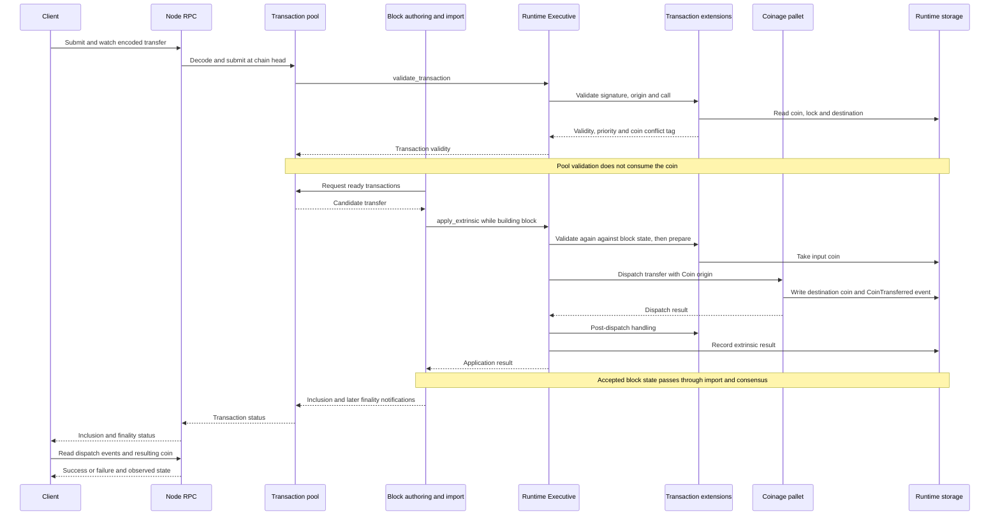
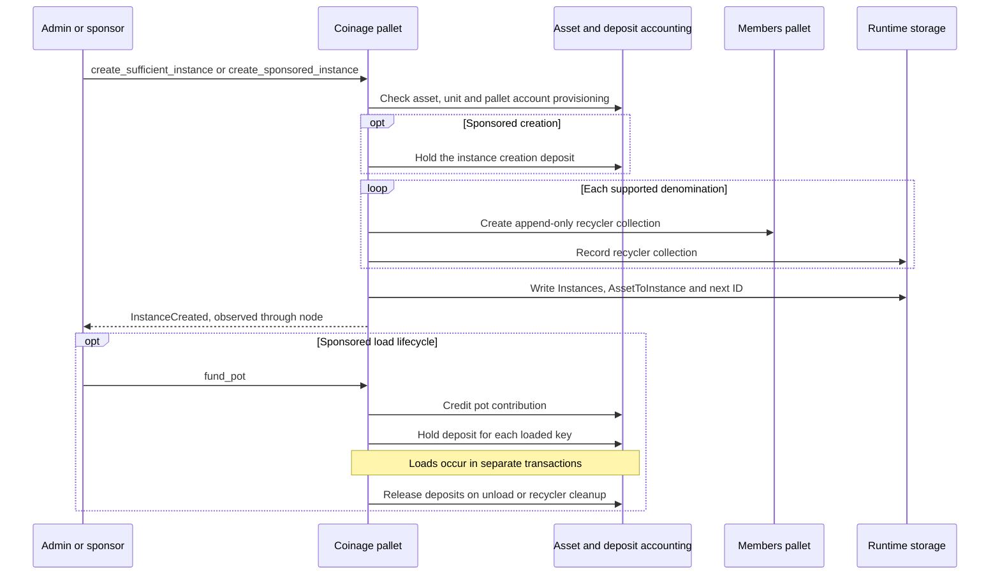
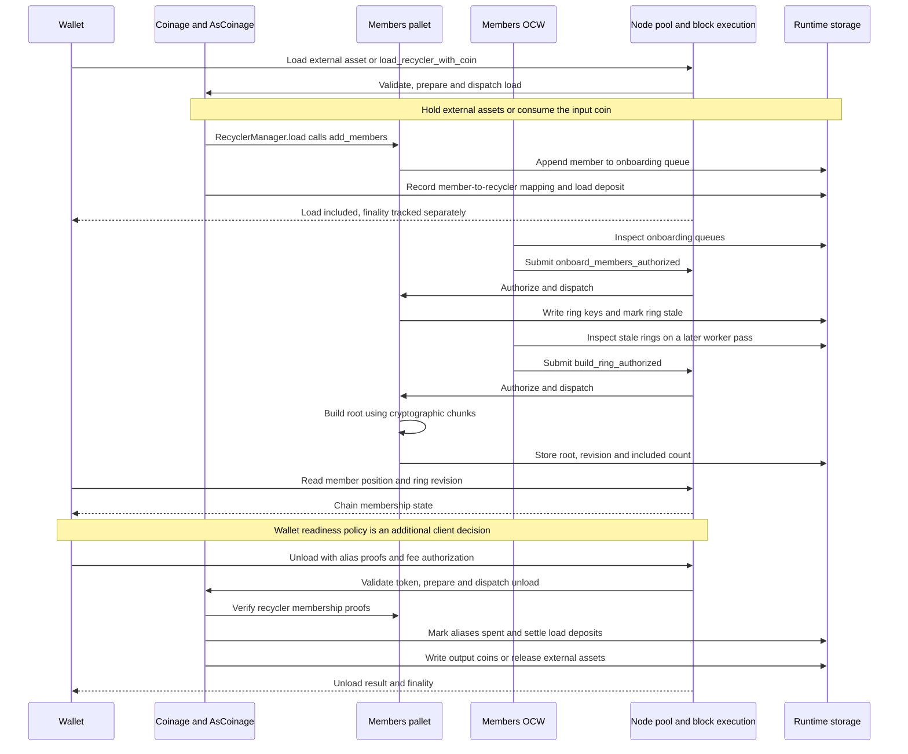
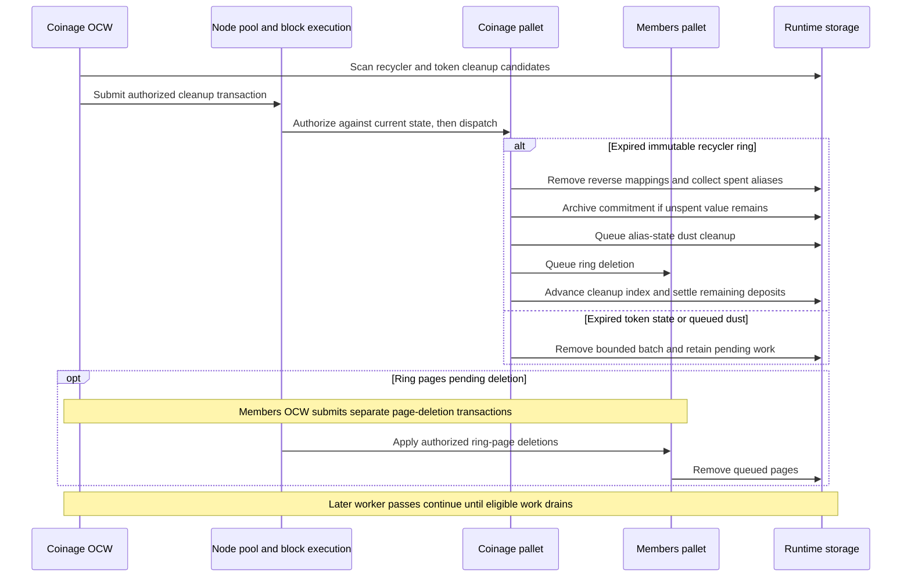

# Coinage runtime components and traces

This expands the `Chain` participant in [user flows](user-flows.md). It follows the current checkout of `individuality-community` at `fce93ef38a15c673a8b0b208362bc46ae755c7d7`, using `next-people-paseo`. The [four wallet components](../test-design/wallet-module-components.md) remain the load generator. Scenarios stay separate.

Runtime execution was checked against the locked `frame-executive` and `sp-runtime` versions, both `48.0.0`. The node path uses SDK `8ae9775dc43c0d8cdd0f6d87700596e14278b1e1` (`polkadot-stable2606-1`), selected by this repository's [node setup][node-setup]. Record the actual node version, RPC method, pool configuration and database backend for each run.

## What the names mean

These are overlapping parts of one system, not separate services:

| Area | Meaning | Where it overlaps |
| ---- | ------- | ----------------- |
| Instance | An asset, coin unit and sufficient or sponsored mode in `Instances`. | Coins carry an instance ID. Recycler collections belong to an instance and denomination. Sponsored loads use its pot. |
| Coin | One `Coin` record keyed by its owner account in `CoinsByOwner`. | Transfer and split replace coins. Recycling consumes a coin and queues a member key. |
| Recycler | Coinage bookkeeping over an append-only Members collection. A collection contains successive rings. | Loads add voucher member keys. Unloads prove membership and mark aliases spent. |
| Member rings | Queued keys, ring pages, roots and revisions managed by the Members pallet. | Recyclers, paid unload tokens and personhood proofs depend on Members. |
| Unload token | Authorization to pay for an unload, using a person allowance, a paid token or output value. | The extension checks authorization; dispatch checks recycler proofs and creates outputs. |
| Offchain worker (OCW) | Node-side execution that discovers maintenance work and submits authorized transactions. | Coinage and Members have separate workers. The resulting calls share the pool and block budget with user calls. |

## Components and dependencies

Coinage rows below are logical boundaries inside the same pallet. They do not replace the artifact IDs in [user flows](user-flows.md#component-and-artifact-catalogue). Measurements are proposed observations, not existing telemetry or test scenarios.

| Component | Responsibility and output | Dependencies | Measure |
| --------- | ------------------------- | ------------ | ------- |
| RPC and transaction pool | Decode submissions, obtain validity and queue transactions; report status. | Runtime API, chain heads and pool limits. | Rejection reasons, queue size, revalidation and time to inclusion. |
| Block authoring and runtime execution | Select transactions, apply extensions, dispatch calls and record results. | Pool, Executive, runtime weights, storage and authoring deadline. | Execution time, weight, proof size and why authoring stops. |
| Instance and pot accounting | Register asset/unit pairs and reserve or release sponsored load deposits. | Asset balances, Members collections and deposit configuration. | Instance/collection count, pot availability and deposit balance. |
| Coin operations | Consume one coin and create its outputs, or move its value into a recycler or external asset. | `AsCoinage`, owner-keyed storage, instance and age/output limits. | Calls, outputs, storage accesses and failure locks. |
| Recycler management | Queue keys, verify unload proofs, track aliases and archive expired rings. | Members, instance configuration, clock and pot accounting. | Loaded/unloaded keys, alias count, proof cost and archives. |
| Member-ring maintenance | Move queued keys into rings, build roots and delete old state. | Authorized calls, cryptographic chunks, clock and root-change notifier. | Queue-to-root delay, keys included per build and deletion backlog. |
| Unload authorization | Validate and consume free/paid tokens or reserve an output-funded alias. | People/LitePeople proof validation, Members, periods and fee conversion. | Validation cost, token consumption and failed-dispatch penalties. |
| OCW scheduling | Scan eligible state and submit bounded maintenance calls. | Imported chain state, local submission and worker configuration. | Scan time, submitted calls, inclusion delay and work left pending. |
| Runtime storage and node database | Read/write pallet state and persist the selected chain state. | FRAME storage, trie implementation, database and caches. | State size, read/write time, proof size and database growth. |

Sources: [runtime wiring][runtime], [Coinage calls and storage][coinage], [extensions][extension], [recyclers][recycler], [pots][pot], [paid tokens][paid-tokens], [Members][members] and [runtime configuration][config].

## One coin transaction: client to runtime and back

Example: the recipient claims a payment coin with `transfer(to)` under `AsCoin`. The input exists, is unlocked and is below the maximum age; the destination has no coin. The instance ID comes from the input coin. No recycler or ring build is needed for this call.

This uses the SDK's `author_submitAndWatchExtrinsic` path as a concrete node entry point. Other RPC methods can expose different status events. Pool acceptance, block inclusion and successful dispatch are different results. Observe finality separately; block construction is not finality.

`AsCoinage::validate` returns a conflict tag for the input owner. During block application, `prepare` removes the coin before dispatch. For an `AsCoin` dispatch failure, `post_dispatch_details` restores the coin and adds a retry lock. A validation rejection never reaches dispatch. Transfer is intended to succeed after its preconditions pass.

Sources: [RPC watch][rpc], [pool validation][pool], [proposer][proposer], [runtime APIs][runtime-api], [Executive][executive], [extension pipeline][pipeline], [AsCoinage][extension] and [transfer][transfer]. The local network is a parachain: validation and finality also depend on its relay chain. See the overview's [runtime and node hypotheses](../README.md#runtime-and-node-failure-hypotheses) for PVF observations.

## Instances and sponsored deposits

Instance creation is setup work, not a step in each payment. An instance is a storage record within one Coinage pallet, not another pallet deployment or transaction pool. The following diagrams expand runtime work; submitted calls still use the node path above.

`do_create_instance` creates one collection per supported denomination. Both the Members worker and Coinage cleanup worker iterate collection state. Increasing instance count therefore increases the state scanned, even before payment volume changes. Instances share the pool, block budget and storage backend.

Sponsored loads require available pot collateral. Unload settles deposits for unloaded keys; recycler cleanup settles the archived remainder. Keep pot funding distinct from the wrapped asset backing the coins. Sources: [instance creation][instances], [collection creation][recycler] and [pot accounting][pot].

## Recycler load, ring readiness and unload

A wallet voucher is represented on chain by a member key and its membership state. It is not a circulating `CoinsByOwner` entry. A load queues the key; subsequent Members calls put it into a ring and build a root.

The diagram shows the normal OCW path. Workers can act on imported blocks before finality. Each maintenance call goes through validation, the pool and block execution; an OCW does not build a consensus ring root by writing local state. Ring construction can require several calls. `build_ring` reads chunks through `ChunksManager` and invokes the root-change notifier; that notifier records updates only for subscribed collections.

Fee authorization and recycler proof checks occur at different stages:

| Authorization | Extension validation and preparation | Dispatch and failure consequence |
| ------------- | ------------------------------------ | -------------------------------- |
| People or LitePeople | Verify person proof, allowance and unused token; consume the free token in `prepare`. | Verify recycler alias proofs and create outputs. A dispatch failure does not refund the token. |
| Paid token | Verify paid-ring proof and unused alias; consume the token in `prepare`. | Verify recycler alias proofs and create outputs. A dispatch failure does not refund the token. |
| Fee from output | Verify the first recycler alias; reserve it in `prepare`. | Verify remaining proofs and deduct the fee. Failure locks the first alias for retry. |

`unload_recycler_into_coin` creates one age-0 coin. `unload_recycler_into_coins` creates split outputs at age 1. Transfer and split increment age; the runtime does not automatically recycle coins at a wallet threshold. Direct offboarding is another branch: `direct_offboard_coin_into_external_asset` consumes a coin and releases its backing without using a recycler, at any coin age in this source snapshot.

Sources: [recycler load/unload][recycler], [Members queue and ring work][members], [unload calls][coinage], [token validation and failure handling][extension] and [root-change notification][notifier].

## OCW cleanup and archive recovery

Cleanup runs alongside payments. Coinage's worker proposes cleanup; Members' worker handles ring pages, old roots and collection deletion. These are additional transactions, not hidden steps inside every payment.

- **Recycler expiry:** measured from `immutable_since`, once the append-only ring is full and built. It is not the age of a circulating coin. Normal unload rejects an expired ring even before cleanup runs.
- **Archives:** cleanup preserves backing for unspent vouchers. `unload_archived_recycler_into_external_asset` recovers value using the archived commitment and proofs. Cleanup does not simply burn the remaining value.
- **Tokens:** free-token cleanup removes expired consumed-token entries. Paid-token cleanup processes rings in order, then deletes the expired collection; alias dust has separate bounded calls.
- **Authorization:** maintenance calls accept local or in-block sources and check their state preconditions. A remote load generator cannot submit these calls through ordinary external RPC as if they were user transactions.
- **Block hook:** Coinage also has `on_poll`, which ensures the current paid-token collection exists within a weight budget. This runs in block execution, not in an OCW.

Sources: [Coinage hooks][hooks], [authorized cleanup calls][cleanup], [recycler expiry and archives][recycler], [paid-token cleanup][paid-tokens] and [Members maintenance][members].

## Storage and isolation boundaries

`CoinsByOwner` is one global `Blake2_128Concat` map keyed by owner account. The instance ID is inside the coin value. A wallet with many coins therefore uses many owner keys; it does not create one large per-wallet coin list in this map. Recycler alias state is keyed by instance, denomination, ring and alias. Members stores ring keys in pages. These layouts identify what to measure; they do not prove that storage cost stays flat as state grows.

| Keep real | Supply or replace for an isolated test | What this does not establish |
| --------- | ------------------------------------ | --------------------------- |
| Coinage extension and dispatch | Seeded runtime state, keys and controlled time; run both validation and application. | Node pool, database or finality capacity. Direct pallet calls skip extension work. |
| Recycler proof verification and ring construction | Valid keys/proofs, initialized chunks, fixed rings and revisions. | OCW scheduling or pool delay. |
| Instance and deposit accounting | Funded assets, named instance modes and pot balances. | Contention from unrelated node traffic. |
| OCW scheduling | Snapshot state, controlled block/time inputs and a captured submission queue. | Whether submitted maintenance is included or clears the backlog. |
| Storage performance | Real node backend with seeded state and stated cache conditions. | Production behaviour under another backend or machine configuration. |

For the full trace, keep the node, runtime, real proofs, storage and both workers active. Record user calls and maintenance calls separately. Measure load-to-inclusion, load-to-built-root and load-to-wallet-readiness separately. Sources: [Coinage storage][coin-storage] and [Members storage][member-storage].

[node-setup]: https://github.com/paritytech/individuality-community/blob/fce93ef38a15c673a8b0b208362bc46ae755c7d7/e2e/zombienet/scripts/00-install-binaries.sh
[runtime]: https://github.com/paritytech/individuality-community/blob/fce93ef38a15c673a8b0b208362bc46ae755c7d7/runtimes/next-people-paseo/src/lib.rs#L203
[runtime-api]: https://github.com/paritytech/individuality-community/blob/fce93ef38a15c673a8b0b208362bc46ae755c7d7/runtimes/next-people-paseo/src/lib.rs#L1398
[config]: https://github.com/paritytech/individuality-community/blob/fce93ef38a15c673a8b0b208362bc46ae755c7d7/runtimes/next-people-paseo/src/people.rs#L1643
[coinage]: https://github.com/paritytech/individuality-community/blob/fce93ef38a15c673a8b0b208362bc46ae755c7d7/pallets/coinage/src/lib.rs
[coin-storage]: https://github.com/paritytech/individuality-community/blob/fce93ef38a15c673a8b0b208362bc46ae755c7d7/pallets/coinage/src/lib.rs#L664
[extension]: https://github.com/paritytech/individuality-community/blob/fce93ef38a15c673a8b0b208362bc46ae755c7d7/pallets/coinage/src/extension.rs#L377
[transfer]: https://github.com/paritytech/individuality-community/blob/fce93ef38a15c673a8b0b208362bc46ae755c7d7/pallets/coinage/src/lib.rs#L2440
[instances]: https://github.com/paritytech/individuality-community/blob/fce93ef38a15c673a8b0b208362bc46ae755c7d7/pallets/coinage/src/lib.rs#L4278
[recycler]: https://github.com/paritytech/individuality-community/blob/fce93ef38a15c673a8b0b208362bc46ae755c7d7/pallets/coinage/src/recycler_manager.rs
[pot]: https://github.com/paritytech/individuality-community/blob/fce93ef38a15c673a8b0b208362bc46ae755c7d7/pallets/coinage/src/pot.rs
[paid-tokens]: https://github.com/paritytech/individuality-community/blob/fce93ef38a15c673a8b0b208362bc46ae755c7d7/pallets/coinage/src/paid_tkn_manager.rs
[members]: https://github.com/paritytech/individuality-community/blob/fce93ef38a15c673a8b0b208362bc46ae755c7d7/pallets/members/src/lib.rs#L464
[member-storage]: https://github.com/paritytech/individuality-community/blob/fce93ef38a15c673a8b0b208362bc46ae755c7d7/pallets/members/src/lib.rs#L188
[notifier]: https://github.com/paritytech/individuality-community/blob/fce93ef38a15c673a8b0b208362bc46ae755c7d7/pallets/members-notifier/src/lib.rs#L1658
[hooks]: https://github.com/paritytech/individuality-community/blob/fce93ef38a15c673a8b0b208362bc46ae755c7d7/pallets/coinage/src/lib.rs#L2021
[cleanup]: https://github.com/paritytech/individuality-community/blob/fce93ef38a15c673a8b0b208362bc46ae755c7d7/pallets/coinage/src/lib.rs#L4000
[rpc]: https://github.com/paritytech/polkadot-sdk/blob/8ae9775dc43c0d8cdd0f6d87700596e14278b1e1/substrate/client/rpc/src/author/mod.rs#L221
[pool]: https://github.com/paritytech/polkadot-sdk/blob/8ae9775dc43c0d8cdd0f6d87700596e14278b1e1/substrate/client/transaction-pool/src/graph/pool.rs#L542
[proposer]: https://github.com/paritytech/polkadot-sdk/blob/8ae9775dc43c0d8cdd0f6d87700596e14278b1e1/substrate/client/basic-authorship/src/basic_authorship.rs#L374
[executive]: https://docs.rs/frame-executive/48.0.0/src/frame_executive/lib.rs.html#855-994
[pipeline]: https://docs.rs/sp-runtime/48.0.0/src/sp_runtime/traits/transaction_extension/dispatch_transaction.rs.html#124-165
