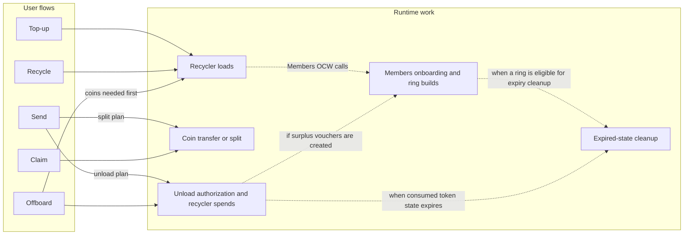
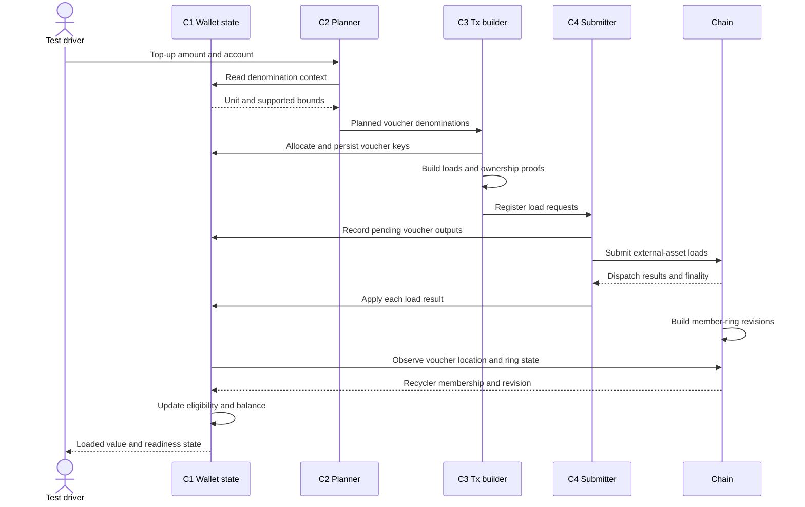
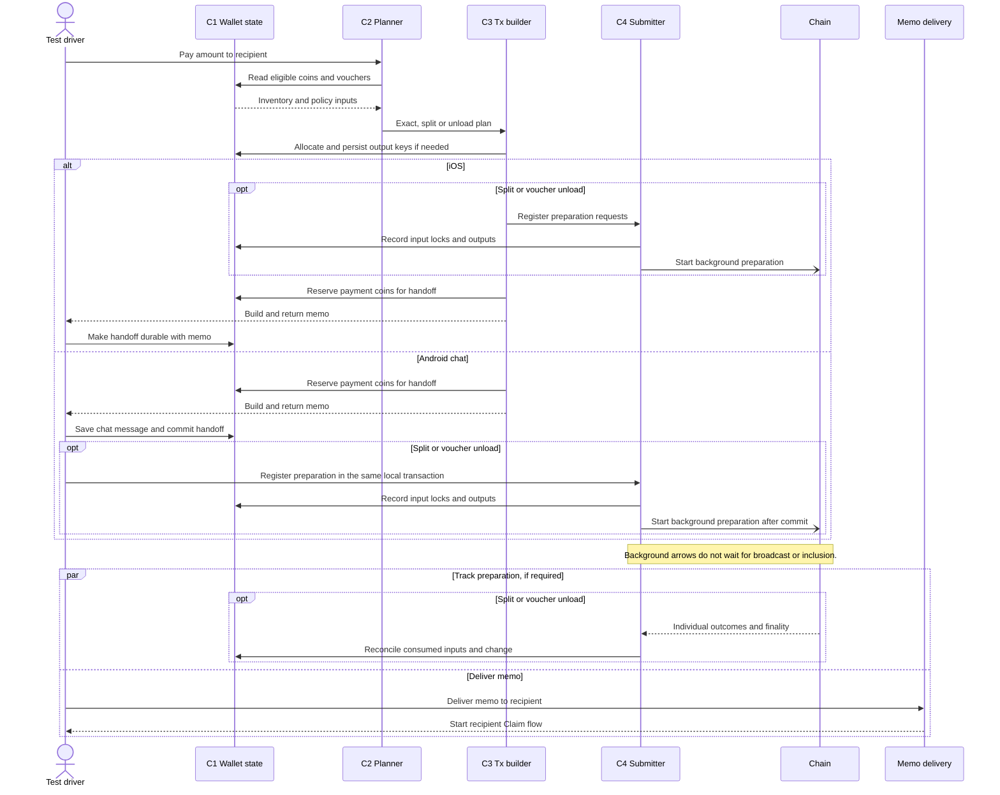
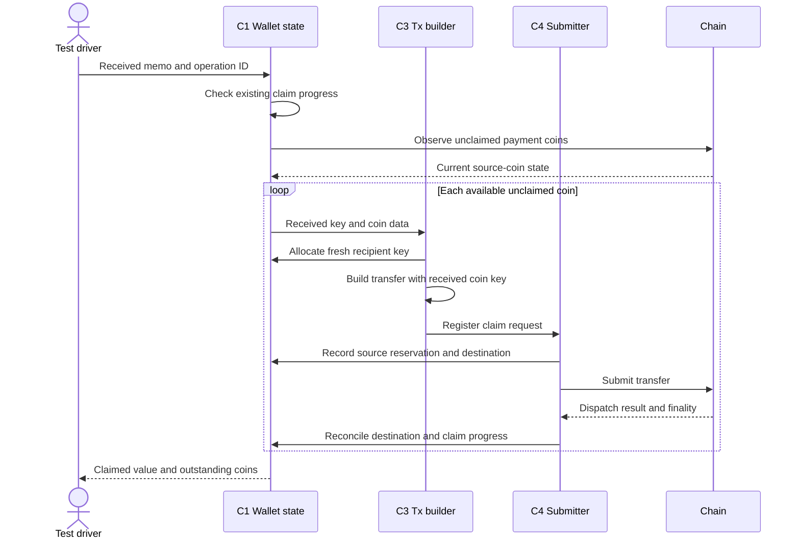
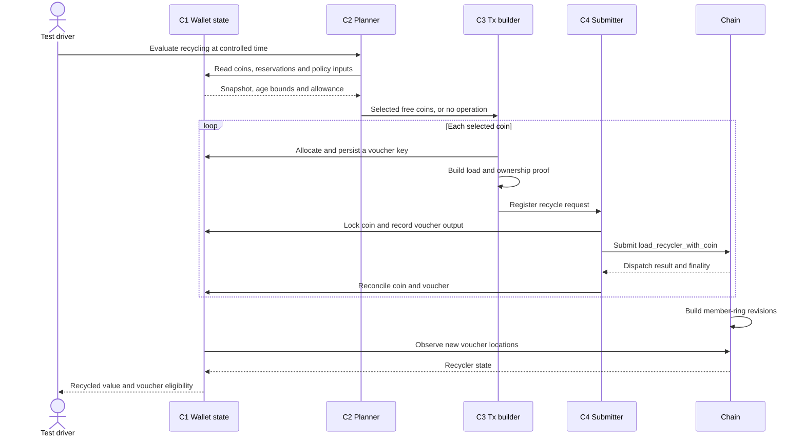
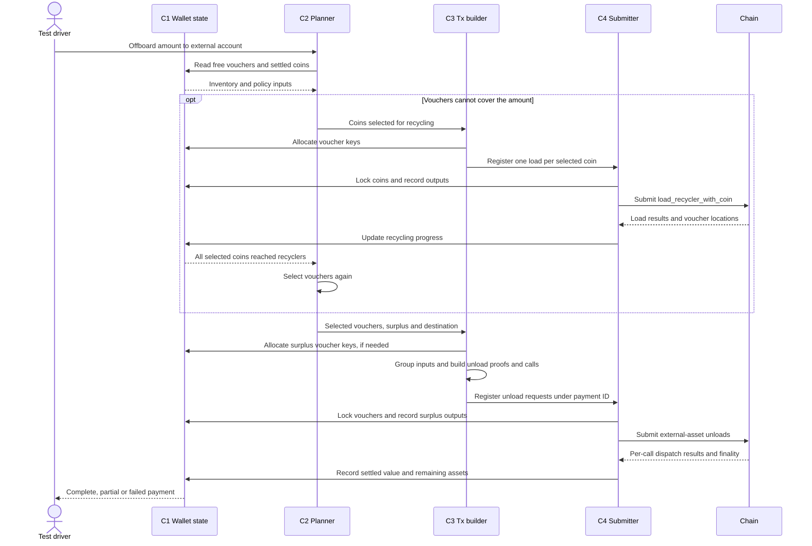

# Coinage user flows

This document records the verified user flows through which profile-generated Coinage operations place load on the system. It is the source for identifying test artifacts, bounded resources and the Wallet policies that can amplify them.

Only flows confirmed from Android Community, iOS Community, the Coinage runtime and the test harness belong here. Brevity may be recorded as supporting evidence but is not authoritative production behaviour.

## Scope

Trace the business operations represented by the profile schema:

- top-up;
- payment;
- recycling;
- offboarding.

A **component** is an implementation unit, such as a wallet planner, RPC client or runtime pallet. An **artifact** is the specific function, queue, call, collection or bounded resource stimulated and measured by a test. Scenarios target artifacts rather than components in the abstract.

## Component and artifact catalogue

The four wallet components and their isolation boundaries are in [wallet module test components](../test-design/wallet-module-components.md). Artifact IDs below use those component IDs where applicable. Runtime and node artifacts belong to the system under test.

The [runtime components and traces](pallet-components.md) expand the chain side: transaction execution, instances, coins, recyclers, member rings and OCW maintenance.

| ID | Layer | Artifact | Responsibility | Authoritative implementation |
| -- | ----- | -------- | -------------- | ---------------------------- |
| C1.records | Wallet | Asset and operation records | Track inventory, reservations and outcomes | [Native state/engine map](../test-design/wallet-module-components.md#native-implementation-map) |
| C2.topup | Wallet | Denomination breakdown | Convert top-up value into voucher denominations | [Top-up composition](production-policies.md#top-up-composition) |
| C2.payment | Wallet | Payment selection plan | Choose exact coins, split or unload | [Payment construction](production-policies.md#payment-construction) |
| C2.recycle | Wallet | Recycling verdicts | Select coins under the active policy | [iOS evaluator][ios-recycle-policy], [Android policy][android-recycle-policy] |
| C2.offboard | Wallet | External-payment plan | Select vouchers and any coins to recycle | [Offboarding selection](production-policies.md#offboarding-inventory-selection) |
| C3.extrinsics | Wallet | Encoded calls and proofs | Construct valid transaction requests | [Native builder map](../test-design/wallet-module-components.md#native-implementation-map) |
| C4.requests | Wallet | Registered transaction requests | Submit and track each outcome | [Native submitter map](../test-design/wallet-module-components.md#native-implementation-map) |
| R1.calls | Runtime | Coinage dispatchables | Apply the calls named in each flow | [Coinage pallet][runtime-coinage] |
| R2.origins | Runtime | Coinage transaction extensions | Validate coin and unload-token origins | [Coinage extensions][runtime-extensions] |
| R3.rings | Runtime | Member-ring builds | Incorporate voucher members into ring revisions | [Members pallet][runtime-members] |
| R4.cleanup | Runtime | Cleanup calls submitted by the OCWs | Remove expired recycler/token state and deferred member-ring data | [Cleanup trace](pallet-components.md#ocw-cleanup-and-archive-recovery), [Coinage worker][runtime-cleanup] |
| R5.instances | Runtime | Instance registry | Associate assets and coin units with recycler collections | [Instance setup](pallet-components.md#instances-and-sponsored-deposits) |
| R6.pots | Runtime | Sponsored load-deposit accounting | Reserve collateral on load and settle it on unload or cleanup | [Deposit lifecycle](pallet-components.md#instances-and-sponsored-deposits) |
| R7.recyclers | Runtime | Recycler member and alias records | Track loaded keys and prevent repeated voucher spends | [Recycler lifecycle](pallet-components.md#recycler-load-ring-readiness-and-unload) |
| N1.pool | Node | Transaction pool | Admit, queue and report transactions before inclusion | [Node and runtime trace](pallet-components.md#one-coin-transaction-client-to-runtime-and-back) |
| N2.execution | Node/runtime | Block execution budget | Bound the calls included and executed in a block | [Authoring and execution](pallet-components.md#one-coin-transaction-client-to-runtime-and-back) |
| N3.storage | Node/runtime | State trie and database | Read, update and persist runtime state | [Storage layout and test boundary](pallet-components.md#storage-and-isolation-boundaries) |

## Flow to runtime and scenario map

The wallet chooses the calls. Wallet submissions enter through RPC and the pool (`N1.pool`); included calls use runtime execution and storage (`N2.execution`, `N3.storage`). OCWs submit locally into the pool. The map below expands the `Chain` box in the user-flow diagrams. Solid arrows show work reached by a flow; dotted arrows show later maintenance, not another wallet call.

Exact-coin send has no sender-side chain call; its recipient still claims each coin. Reading or verifying a ring does not build a new one. The map follows the documented native flows: direct coin offboarding and archived recovery are runtime capabilities, not paths used by these app snapshots.

| Flow or lifecycle work | Runtime components reached | Scenario drafts |
| ---------------------- | -------------------------- | --------------- |
| [Top-up](#top-up--onboarding) | Unpaid origin validation (`R2`), asset-backed loads (`R1`, `R7`) and later ring work (`R3`). [Trace](pallet-components.md#recycler-load-ring-readiness-and-unload). | [Top-up burst](../test-design/scenarios/top-up-burst.md) |
| [Send](#send) | Exact: no preparation call. Split: coin origin and outputs (`R2`, `R1`). Unload: token authorization, recycler proofs and output coins (`R2`, `R7`, `R1`). [Trace](pallet-components.md#recycler-load-ring-readiness-and-unload). | [Payment burst](../test-design/scenarios/payment-burst.md); [free-quota exhaustion](../test-design/scenarios/free-quota-exhaustion.md) for free-token unloads |
| [Claim](#claim) | Coin authorization and one transfer per received coin (`R2`, `R1`); owner-keyed storage (`N3`). [Trace](pallet-components.md#one-coin-transaction-client-to-runtime-and-back). | [Claim burst](../test-design/scenarios/claim-burst.md); [merchant fan-in](../test-design/scenarios/merchant-fan-in.md); [payment burst](../test-design/scenarios/payment-burst.md) |
| [Recycling](#recycling) | Consume coins and queue voucher keys (`R2`, `R1`, `R7`), then build rings (`R3`). [Trace](pallet-components.md#recycler-load-ring-readiness-and-unload). | [Synchronised recycling](../test-design/scenarios/synchronised-recycling.md) |
| [Offboarding](#offboarding) | Recycle first if needed; then authorize unloads, consume vouchers and release external assets (`R2`, `R7`, `R1`). Fresh surplus vouchers add ring work (`R3`). [Trace](pallet-components.md#recycler-load-ring-readiness-and-unload). | [Offboarding burst](../test-design/scenarios/offboarding-burst.md); [free-quota exhaustion](../test-design/scenarios/free-quota-exhaustion.md) |
| Instance setup and deposits | `R5` is normally seeded before measurement. Sponsored loads reserve `R6` collateral; unload and cleanup settle it. [Trace](pallet-components.md#instances-and-sponsored-deposits). | Relevant setup for load/unload scenarios. Instance creation and pot exhaustion have no dedicated draft yet. |
| Background cleanup | Coinage and Members OCWs submit `R4` calls through the same pool and block budget. [Trace](pallet-components.md#ocw-cleanup-and-archive-recovery). | [Full-flow ramp](../test-design/scenarios/full-flow-ramp.md) can observe this only if its state and duration reach cleanup conditions. No dedicated cleanup draft yet. |

`R1`–`R7` and `N3` abbreviate the catalogue IDs above. These links describe intended coverage, not completed tests. The [full-flow ramp](../test-design/scenarios/full-flow-ramp.md) combines the user flows; it does not exercise every lifecycle branch automatically.

## User flows

Each flow must identify its ordered artifacts, the applicable production-policy variants and the runtime calls it reaches.

Distinguish registration, submission, inclusion, successful dispatch and finality. The diagrams show successful paths; retain each call's failure or partial result in C1. Measure completion at successful finality, even where the app reports progress earlier. Count actual calls; do not assume a fixed number of extrinsics per payment.

The five diagrams cover onboarding, send, claim, recycling and offboarding. Send and claim together trace one payment from intent to recipient ownership.

The driver seeds agents, supplies intents and stands in for app orchestration, chat persistence and scheduling. Memo delivery can use a controlled transport. C1–C4 group native responsibilities; these diagrams do not describe an implemented harness. Time, runtime configuration and the selected [production policy](production-policies.md) are inputs to each run.

### Top-up / Onboarding

**Chain path:** [Recycler load and ring construction](pallet-components.md#recycler-load-ring-readiness-and-unload).

Start with a funded external-asset account. C2 applies `inventory.top_up.composition`: largest supported denomination first, repeated as needed. Each selected item becomes a voucher, not a coin. Any sub-denomination remainder stays in the external asset.

iOS uses `load_recycler_with_external_asset_unpaid_batch`, chunked by the runtime batch limit. Android uses one `load_recycler_with_external_asset_unpaid` per voucher. Both use the asset holder's unpaid signed origin and include the instance ID. A local submission group is not an atomic chain batch. Load finality and voucher readiness are separate observations; ring construction can overlap load processing.

Readiness follows the privacy preset: immediate use in a recycler, or a ring-fill threshold, or minimum membership plus time since recycler entry. This is not a universal six-hour lock. iOS still [allocates a random `readyAt`][ios-voucher-allocation], but its active policy uses [recycler-entry time][ios-readiness-time] instead. See [iOS readiness][ios-readiness] and [Android readiness][android-readiness].

Source: [iOS loader][ios-onboard]; [Android onboarding][android-onboard] and [load construction][android-onboard-build].

### Payment
#### Send

**Chain path:** [Coin operations](pallet-components.md#one-coin-transaction-client-to-runtime-and-back) for a split, or [unload authorization and recycler spends](pallet-components.md#recycler-load-ring-readiness-and-unload). Exact-coin send skips preparation on chain.

C2 applies `wallet.payment_construction`: exact coins, then a split, then voucher unloads. Unload outputs use `wallet.recycling.output_composition`. C1 reserves value before its secrets can leave the wallet. Exact coins need no sender-side chain call.

At these commits, iOS registers preparation before reserving the handoff and returning the memo. Android builds the memo first, then registers preparation in the transaction that saves the chat message. Background preparation submits `split` or `unload_recycler_into_coins`; broadcast and memo delivery can overlap. Neither chat path waits for preparation finality. A delivered memo is not a completed payment.

Android's external-submitter path waits up to two minutes for every request to leave `PENDING_SUBMISSION`, and fails the send on timeout or a failed request. This waits for submission, not inclusion; a timeout does not cancel scheduled work. Android enables preparation retries with a six-hour deadline for chat and five minutes for merchant sends. These are [submission-policy inputs][android-retry-policy], not settlement guarantees; do not discard outstanding operations when a deadline passes.

`split` uses the input coin's `AsCoin` origin. `unload_recycler_into_coins` uses an unload-token origin with the required ownership proofs, one call per planned batch. Free-token availability, ring revisions and runtime input/output bounds constrain the plan. See [platform differences](production-policies.md#payment-construction).

Source: [iOS sender][ios-send] and [split preparation][ios-split]; [Android preparation][android-send] and [chat handoff][android-chat].

#### Claim

**Chain path:** [Coin transfer from the client through the node and runtime](pallet-components.md#one-coin-transaction-client-to-runtime-and-back).

Claim starts from the received memo. It uses fixed per-coin transfers; it does not run the payment selector again. Wait for source coins or reconcile existing claim records. A payment can be partly claimed.

Both apps issue one `transfer` per claimed coin, using that coin's `AsCoin` origin. Claims can run concurrently and be registered as a group; the diagram does not require serial finality waits. Keep partial progress and detect the remaining coins on later passes. Record full completion only when all required claims have succeeded and finalised.

Both claim services wait up to 30 seconds per detection pass, then claim the coins already visible. Missing coins do not block those claims. iOS chat supplies a six-hour retry deadline when processing starts ([caller][ios-receive], [constant][ios-constants]); this is not a hard six-hour finality timeout. The loop can continue while coins remain claimable. Keep sender-preparation and recipient-claim retries separate in the load model.

Source: [iOS chat receiver][ios-receive] and [claim service][ios-claim]; [Android detection][android-detect] and [claim construction][android-claim].

### Recycling

**Chain path:** [Coin-to-recycler load and later ring construction](pallet-components.md#recycler-load-ring-readiness-and-unload).

C1 supplies coin state; C2 applies the active recycling policy and allowance conditions. This is a separate lifecycle operation. Do not hard-code every run to an age-only sweep: [production policies](production-policies.md#recycling-unavailable-handling) include discretionary decisions, a quota reserve and a forced-age guard.

Both apps use one `load_recycler_with_coin` per selected coin, signed with that coin's `AsCoin` origin. They can register several requests together; the loop does not require serial submission. Recycling ends with vouchers. A later send or offboard can unload them; recycling does not itself create replacement spendable coins. Load success, ring readiness and privacy eligibility remain separate states.

Source: [iOS evaluation][ios-recycle-policy] and [submission][ios-recycle]; [Android policy][android-recycle-policy] and [submission][android-recycle].

### Offboarding

**Chain path:** [Recycler unload to external assets](pallet-components.md#recycler-load-ring-readiness-and-unload), after recycling input coins if needed.

C2 applies [offboarding inventory selection](production-policies.md#offboarding-inventory-selection): use vouchers first; if they cannot cover the amount, recycle enough coins to fill the deficit, then select vouchers again. Both apps exit through recycler unloads, not `direct_offboard_coin_into_external_asset`.

The calls are `unload_recycler_into_external_asset` and, for the call returning surplus vouchers, `unload_recycler_into_external_asset_and_loaded_coins`. Each uses an unload-token origin with a free token and `max_fee = 0`. iOS chunks recycler groups by `MaxConsolidation`; Android's offboarding path does not. An oversized Android group can fail before dispatch; see the linked policy for the runtime bound.

Both apps can start unloading after the selected coins reach recyclers in the best block, without waiting for recycling finality or the normal privacy delay. Incomplete recycling stops the payment. Unload calls settle separately, so record partial value delivered to the external account. There is no payment memo or recipient Coinage claim.

Source: [iOS recycling transition][ios-offboard-recycle] and [unload service][ios-offboard]; [Android recycling transition][android-offboard-recycle] and [unload service][android-offboard].

## Stress surfaces

A stress surface is a resource that can grow, saturate or reach an implementation or runtime bound along a verified flow.

| Artifact | Resource under load | Known bound | Influencing Wallet policies |
| -------- | ------------------- | ----------- | --------------------------- |

## Policy-to-artifact mapping

Concrete adversarial overrides are defined only after this mapping identifies the artifact and resource they are intended to stress.

| Wallet-policy key | Influenced artifacts | Stress objective | Applicable constraints |
| ----------------- | -------------------- | ---------------- | ---------------------- |

[ios-onboard]: https://github.com/paritytech/polkadot-ios-community/blob/b960f771049c07819de1f201b901b037613d42e9/Packages/Coinage/Sources/VoucherLoader.swift
[android-onboard]: https://github.com/paritytech/polkadot-android-community/blob/f875be37451f5282a92dec2aa9bf764ac5e64f43/feature/coinage/impl/src/main/java/io/paritytech/polkadotapp/feature_coinage_impl/domain/usecase/RealOnboardingUseCase.kt
[android-onboard-build]: https://github.com/paritytech/polkadot-android-community/blob/f875be37451f5282a92dec2aa9bf764ac5e64f43/feature/coinage/impl/src/main/java/io/paritytech/polkadotapp/feature_coinage_impl/domain/usecase/CoinageOnboardingSubmissionUseCase.kt
[ios-send]: https://github.com/paritytech/polkadot-ios-community/blob/b960f771049c07819de1f201b901b037613d42e9/Packages/Coinage/Sources/Transfer/TransferSenderService.swift
[ios-split]: https://github.com/paritytech/polkadot-ios-community/blob/b960f771049c07819de1f201b901b037613d42e9/Packages/Coinage/Sources/Transfer/Plan/Strategies/SplitCoinStrategy.swift
[android-send]: https://github.com/paritytech/polkadot-android-community/blob/f875be37451f5282a92dec2aa9bf764ac5e64f43/feature/coinage/impl/src/main/java/io/paritytech/polkadotapp/feature_coinage_impl/domain/usecase/RealPrepareCoinageTransferUseCase.kt
[android-chat]: https://github.com/paritytech/polkadot-android-community/blob/f875be37451f5282a92dec2aa9bf764ac5e64f43/feature/wallet/impl/src/main/java/io/paritytech/polkadotapp/feature_wallet_impl/presentation/enterAmount/domain/SendEnterAmountInteractor.kt
[ios-receive]: https://github.com/paritytech/polkadot-ios-community/blob/b960f771049c07819de1f201b901b037613d42e9/polkadot-app/Modules/Coinage/Services/CoinageTransferMonitor.swift
[ios-claim]: https://github.com/paritytech/polkadot-ios-community/blob/b960f771049c07819de1f201b901b037613d42e9/Packages/Coinage/Sources/Transfer/Claim/ClaimCoinsService.swift
[android-detect]: https://github.com/paritytech/polkadot-android-community/blob/f875be37451f5282a92dec2aa9bf764ac5e64f43/feature/coinage/impl/src/main/java/io/paritytech/polkadotapp/feature_coinage_impl/domain/usecase/RealClaimReceivedCoinsUseCase.kt
[android-claim]: https://github.com/paritytech/polkadot-android-community/blob/f875be37451f5282a92dec2aa9bf764ac5e64f43/feature/coinage/impl/src/main/java/io/paritytech/polkadotapp/feature_coinage_impl/domain/usecase/RealCoinageTransferSubmissionUseCase.kt
[ios-recycle-policy]: https://github.com/paritytech/polkadot-ios-community/blob/b960f771049c07819de1f201b901b037613d42e9/Packages/Coinage/Sources/Recycling/CoinRecyclingEvaluator.swift
[ios-recycle]: https://github.com/paritytech/polkadot-ios-community/blob/b960f771049c07819de1f201b901b037613d42e9/Packages/Coinage/Sources/Recycling/CoinageRecyclingService.swift
[android-recycle-policy]: https://github.com/paritytech/polkadot-android-community/blob/f875be37451f5282a92dec2aa9bf764ac5e64f43/feature/coinage/impl/src/main/java/io/paritytech/polkadotapp/feature_coinage_impl/domain/recycling/RecyclingStrategyProvider.kt
[android-recycle]: https://github.com/paritytech/polkadot-android-community/blob/f875be37451f5282a92dec2aa9bf764ac5e64f43/feature/coinage/impl/src/main/java/io/paritytech/polkadotapp/feature_coinage_impl/domain/usecase/RealCoinageRecyclingUseCase.kt
[ios-voucher-allocation]: https://github.com/paritytech/polkadot-ios-community/blob/b960f771049c07819de1f201b901b037613d42e9/Packages/Coinage/Sources/Allocators/VoucherAllocator.swift
[ios-readiness-time]: https://github.com/paritytech/polkadot-ios-community/blob/b960f771049c07819de1f201b901b037613d42e9/Packages/Coinage/Sources/Recycling/Strategy/RecyclingParams.swift#L44-L51
[ios-readiness]: https://github.com/paritytech/polkadot-ios-community/blob/b960f771049c07819de1f201b901b037613d42e9/Packages/Coinage/Sources/Recycling/Strategy/ParametricRecyclingStrategy.swift
[android-readiness]: https://github.com/paritytech/polkadot-android-community/blob/f875be37451f5282a92dec2aa9bf764ac5e64f43/feature/coinage/impl/src/main/java/io/paritytech/polkadotapp/feature_coinage_impl/domain/recycling/ParametricRecyclingStrategy.kt
[ios-constants]: https://github.com/paritytech/polkadot-ios-community/blob/b960f771049c07819de1f201b901b037613d42e9/Packages/Coinage/Sources/CoinageConstants.swift#L10-L12
[android-retry-policy]: https://github.com/paritytech/polkadot-android-community/blob/f875be37451f5282a92dec2aa9bf764ac5e64f43/feature/coinage/impl/src/main/java/io/paritytech/polkadotapp/feature_coinage_impl/domain/transaction/submission/CoinageSubmissionParams.kt#L20-L28
[ios-offboard-recycle]: https://github.com/paritytech/polkadot-ios-community/blob/b960f771049c07819de1f201b901b037613d42e9/Packages/Coinage/Sources/ExternalPayment/StateMachine/States/OnboardCoinsPaymentState.swift
[ios-offboard]: https://github.com/paritytech/polkadot-ios-community/blob/b960f771049c07819de1f201b901b037613d42e9/Packages/Coinage/Sources/ExternalPayment/Service/OffboardVouchersForPaymentService.swift
[android-offboard-recycle]: https://github.com/paritytech/polkadot-android-community/blob/f875be37451f5282a92dec2aa9bf764ac5e64f43/feature/coinage/impl/src/main/java/io/paritytech/polkadotapp/feature_coinage_impl/domain/externalPayment/state/AwaitRecyclingPaymentState.kt
[android-offboard]: https://github.com/paritytech/polkadot-android-community/blob/f875be37451f5282a92dec2aa9bf764ac5e64f43/feature/coinage/impl/src/main/java/io/paritytech/polkadotapp/feature_coinage_impl/domain/externalPayment/usecase/UnloadRecyclerIntoExternalAssetUseCase.kt
[runtime-coinage]: https://github.com/paritytech/individuality-community/blob/fce93ef38a15c673a8b0b208362bc46ae755c7d7/pallets/coinage/src/lib.rs
[runtime-extensions]: https://github.com/paritytech/individuality-community/blob/fce93ef38a15c673a8b0b208362bc46ae755c7d7/pallets/coinage/src/extension.rs
[runtime-members]: https://github.com/paritytech/individuality-community/blob/fce93ef38a15c673a8b0b208362bc46ae755c7d7/pallets/members/src/lib.rs#L881
[runtime-cleanup]: https://github.com/paritytech/individuality-community/blob/fce93ef38a15c673a8b0b208362bc46ae755c7d7/pallets/coinage/src/lib.rs#L2030
