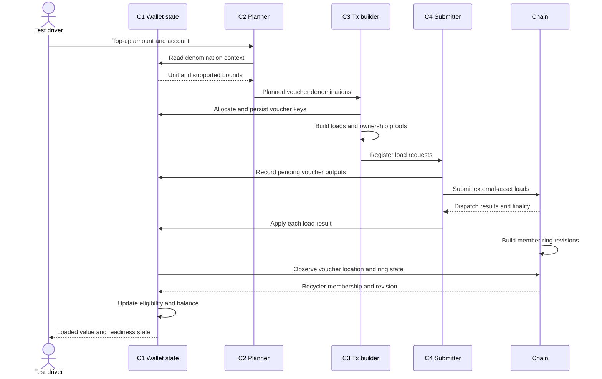
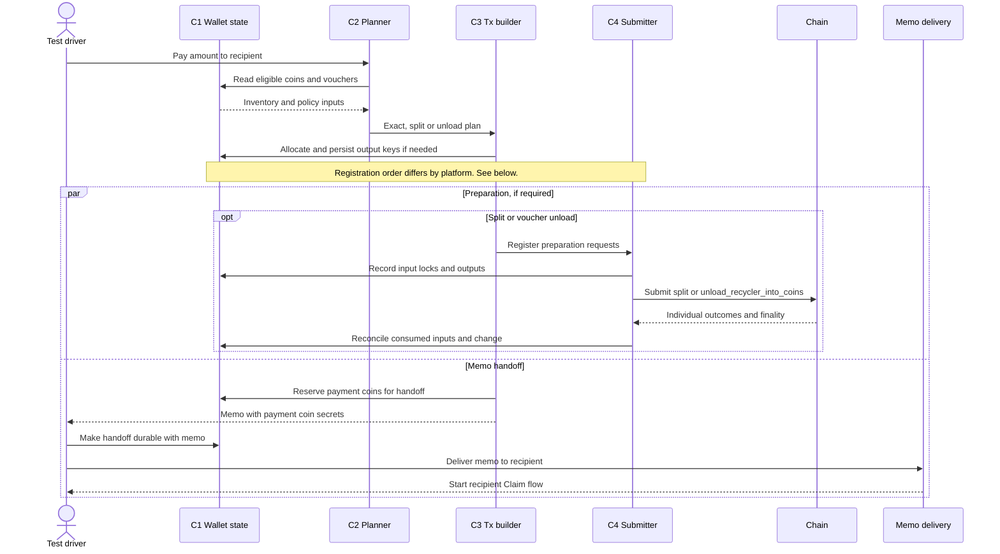
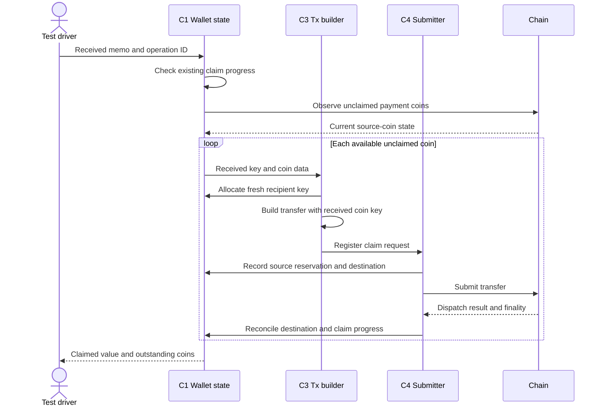
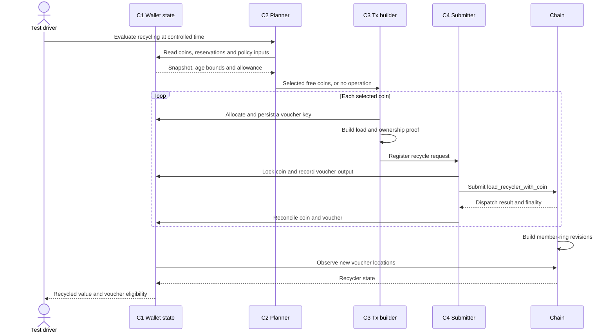

# Coinage load paths

This document records the verified implementation paths through which profile-generated Coinage operations place load on the system. It is the source for identifying test artifacts, bounded resources and the Wallet policies that can amplify them.

Only paths confirmed from Android Community, iOS Community, the Coinage runtime and the test harness belong here. Brevity may be recorded as supporting evidence but is not authoritative production behaviour.

## Scope

Trace the business operations represented by the profile schema:

- top-up;
- payment;
- recycling;
- offboarding.

A **component** is an implementation unit, such as a wallet planner, RPC client or runtime pallet. An **artifact** is the specific function, queue, call, collection or bounded resource stimulated and measured by a test. Scenarios target artifacts rather than components in the abstract.

## Component and artifact catalogue

The four wallet components, native source references and isolation boundaries are in [components](components.md). The chain is the system under test; these components generate its load.

| ID | Component | Artifacts reached by these paths |
| -- | --------- | -------------------------------- |
| C1 | Wallet state | Coin/voucher records, balances, reservations and operation records |
| C2 | Planner | Denomination breakdown, coin/voucher selection and recycling decisions |
| C3 | Transaction builder | Output-key allocation, signatures, recycler proofs, calls and memo encoding |
| C4 | Submitter | Registration, RPC submission, status watches and chain observations |

## Operation paths

Each path must identify its ordered artifacts, the applicable production-policy variants and the runtime calls it reaches.

The four diagrams cover onboarding, send, claim and recycling. Send and claim together trace one payment from intent to recipient ownership. Offboarding remains a separate path below.

The driver seeds agents and supplies intents. It is outside the four components. The diagrams show the test boundary around native behaviour, not an implemented harness. Arrows group native methods by responsibility. Time, runtime configuration and the selected [production policy](production-policies.md) are inputs to each run.

Distinguish registration, submission, inclusion, successful dispatch and finality. The diagrams show successful paths; retain each call's failure or partial result in C1. Measure completion at successful finality, even where the app reports progress earlier. Count actual calls; do not assume a fixed number of extrinsics per payment.

### Top-up / Onboarding

Start with a funded external-asset account. C2 applies `inventory.top_up.composition`: largest supported denomination first, repeated as needed. Each selected item becomes a voucher, not a coin. Any sub-denomination remainder stays in the external asset.

iOS uses `load_recycler_with_external_asset_unpaid_batch`, chunked by the runtime batch limit. Android uses one `load_recycler_with_external_asset_unpaid` per voucher. Both use the asset holder's unpaid signed origin and include the instance ID. A local submission group is not an atomic chain batch. Load finality and voucher readiness are separate observations; ring construction can overlap load processing.

Source: [iOS loader][ios-onboard]; [Android onboarding][android-onboard] and [load construction][android-onboard-build]. Readiness follows the selected policy, not a universal six-hour lock.

### Payment
#### Send

C2 applies `wallet.payment_construction`: exact coins, then a split, then voucher unloads. Unload outputs use `wallet.recycling.output_composition`. C1 reserves value before its secrets can leave the wallet. Exact coins need no sender-side chain call.

At these commits, iOS registers preparation before returning the memo. Android's chat path saves the memo and registers scheduled preparation through the handoff commit. Broadcast and memo delivery can overlap; neither chat path waits for preparation finality. The Android external-submitter path has a separate submission wait. A delivered memo is not a completed payment.

`split` uses the input coin's `AsCoin` origin. `unload_recycler_into_coins` uses an unload-token origin with the required ownership proofs, one call per planned batch. Free-token availability, ring revisions and runtime input/output bounds constrain the plan. See [platform differences](production-policies.md#payment-construction).

Source: [iOS sender][ios-send] and [split preparation][ios-split]; [Android preparation][android-send] and [chat handoff][android-chat].

#### Claim

Claim starts from the received memo. It uses fixed per-coin transfers; it does not run the payment selector again. Wait for source coins or reconcile existing claim records. A payment can be partly claimed.

Both apps issue one `transfer` per claimed coin, using that coin's `AsCoin` origin. Claims can run concurrently and be registered as a group; the diagram does not require serial finality waits. Keep partial progress and detect the remaining coins on later passes. Record full completion only when all required claims have succeeded and finalised.

Source: [iOS chat receiver][ios-receive] and [claim service][ios-claim]; [Android detection][android-detect] and [claim construction][android-claim].

### Recycling

C1 supplies coin state; C2 applies the active recycling policy and allowance conditions. This is a separate lifecycle operation. Do not hard-code every run to an age-only sweep: [production policies](production-policies.md#recycling-unavailable-handling) include discretionary decisions, a quota reserve and a forced-age guard.

Both apps use one `load_recycler_with_coin` per selected coin, signed with that coin's `AsCoin` origin. They can register several requests together; the loop does not require serial submission. Recycling ends with vouchers. A later send or offboard can unload them; recycling does not itself create replacement spendable coins. Load success, ring readiness and privacy eligibility remain separate states.

Source: [iOS evaluation][ios-recycle-policy] and [submission][ios-recycle]; [Android policy][android-recycle-policy] and [submission][android-recycle].

### Offboarding

_To be traced._

## Stress surfaces

A stress surface is a resource that can grow, saturate or reach an implementation or runtime bound along a verified path.

| Artifact | Resource under load | Known bound | Influencing Wallet policies |
| -------- | ------------------- | ----------- | --------------------------- |

## Policy-to-artifact mapping

Concrete adversarial overrides are defined only after this mapping identifies the artifact and resource they are intended to stress.

| Wallet-policy key | Influenced artifacts | Stress objective | Applicable constraints |
| ----------------- | -------------------- | ---------------- | ---------------------- |

[ios-onboard]: https://github.com/paritytech/polkadot-ios-community/blob/b960f771049c07819de1f201b901b037613d42e9/Packages/Coinage/Sources/VoucherLoader.swift
[android-onboard]: https://github.com/paritytech/polkadot-android-community/blob/f875be37451f5282a92dec2aa9bf764ac5e64f43/feature/coinage/impl/src/main/java/io/paritytech/polkadotapp/feature_coinage_impl/domain/usecase/RealOnboardingUseCase.kt
[android-onboard-build]: https://github.com/paritytech/polkadot-android-community/blob/f875be37451f5282a92dec2aa9bf764ac5e64f43/feature/coinage/impl/src/main/java/io/paritytech/polkadotapp/feature_coinage_impl/domain/usecase/CoinageOnboardingSubmissionUseCase.kt
[ios-send]: https://github.com/paritytech/polkadot-ios-community/blob/b960f771049c07819de1f201b901b037613d42e9/Packages/Coinage/Sources/Transfer/TransferSenderService.swift
[ios-split]: https://github.com/paritytech/polkadot-ios-community/blob/b960f771049c07819de1f201b901b037613d42e9/Packages/Coinage/Sources/Transfer/Plan/Strategies/SplitCoinStrategy.swift
[android-send]: https://github.com/paritytech/polkadot-android-community/blob/f875be37451f5282a92dec2aa9bf764ac5e64f43/feature/coinage/impl/src/main/java/io/paritytech/polkadotapp/feature_coinage_impl/domain/usecase/RealPrepareCoinageTransferUseCase.kt
[android-chat]: https://github.com/paritytech/polkadot-android-community/blob/f875be37451f5282a92dec2aa9bf764ac5e64f43/feature/wallet/impl/src/main/java/io/paritytech/polkadotapp/feature_wallet_impl/presentation/enterAmount/domain/SendEnterAmountInteractor.kt
[ios-receive]: https://github.com/paritytech/polkadot-ios-community/blob/b960f771049c07819de1f201b901b037613d42e9/polkadot-app/Modules/Coinage/Services/CoinageTransferMonitor.swift
[ios-claim]: https://github.com/paritytech/polkadot-ios-community/blob/b960f771049c07819de1f201b901b037613d42e9/Packages/Coinage/Sources/Transfer/Claim/ClaimCoinsService.swift
[android-detect]: https://github.com/paritytech/polkadot-android-community/blob/f875be37451f5282a92dec2aa9bf764ac5e64f43/feature/coinage/impl/src/main/java/io/paritytech/polkadotapp/feature_coinage_impl/domain/usecase/RealClaimReceivedCoinsUseCase.kt
[android-claim]: https://github.com/paritytech/polkadot-android-community/blob/f875be37451f5282a92dec2aa9bf764ac5e64f43/feature/coinage/impl/src/main/java/io/paritytech/polkadotapp/feature_coinage_impl/domain/usecase/RealCoinageTransferSubmissionUseCase.kt
[ios-recycle-policy]: https://github.com/paritytech/polkadot-ios-community/blob/b960f771049c07819de1f201b901b037613d42e9/Packages/Coinage/Sources/Recycling/CoinRecyclingEvaluator.swift
[ios-recycle]: https://github.com/paritytech/polkadot-ios-community/blob/b960f771049c07819de1f201b901b037613d42e9/Packages/Coinage/Sources/Recycling/CoinageRecyclingService.swift
[android-recycle-policy]: https://github.com/paritytech/polkadot-android-community/blob/f875be37451f5282a92dec2aa9bf764ac5e64f43/feature/coinage/impl/src/main/java/io/paritytech/polkadotapp/feature_coinage_impl/domain/recycling/RecyclingStrategyProvider.kt
[android-recycle]: https://github.com/paritytech/polkadot-android-community/blob/f875be37451f5282a92dec2aa9bf764ac5e64f43/feature/coinage/impl/src/main/java/io/paritytech/polkadotapp/feature_coinage_impl/domain/usecase/RealCoinageRecyclingUseCase.kt
