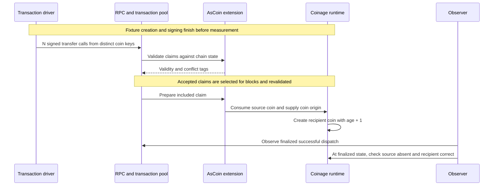

# Claim burst (Draft)

Many recipients claim existing coins at once. This is the first, narrower case of [payment burst](payment-burst.md): one `Coinage.transfer` per coin, signed by its current key into a fresh recipient key.

**User flow:** [Claim](../../coinage/user-flows.md#claim). **Runtime path:** [Coin authorization, consumption and transfer](../../coinage/pallet-components.md#one-coin-transaction-client-to-runtime-and-back).

| Part | This scenario |
| ---- | ------------- |
| Source | Independent source coins and fresh recipient keys. |
| Stimulus | Submit one claim per coin without waiting for another claim to finish. |
| Artifacts | C3.extrinsics, C4.requests, R1.calls, R2.origins, N1.pool and N3.storage. See the [catalogue](../../coinage/user-flows.md#component-and-artifact-catalogue). |
| Response | Each transfer finalizes successfully; the source coin is consumed and the recipient owns the same instance and denomination, with age increased by one. |
| Measures | Finalized claims, failures and unresolved claims; p50/p95/max finality; finalized state checks; time to drain after the last send. |

## Pilot setup

Use the network and transaction tracking from the top-up burst in `polkadot-pop-e2e` PR #34, including the six relay validators and two People collators from #32. Run at zero added delay first.

1. Create a fresh sufficient asset and Coinage instance on the disposable fork.
2. Mint backing assets into the Coinage pallet account: the total value of the fixture coins plus the asset minimum balance.
3. Use root `System.set_storage` to seed one `CoinsByOwner` entry per source, encoded with the selected runtime metadata. Each has the new instance ID, denomination `1`, and age `0`. Source and recipient keys are unique. Verify all source entries, absent recipient entries, backing and the instance before measuring.
4. Prepare `Coinage.transfer` calls with the `AsCoin` extension and the source signatures. Prepare keys and signatures outside the timed window. Record mortality; immortal transactions are allowed only on this disposable fork.
5. Complete a one-claim smoke test, including finalized source and recipient state checks. Use a fresh instance and keys for each following stage: 100, then optionally 1,000 claims. These are pilot sizes, not capacity targets.

**Fixture boundary:** root storage writes bypass coin issuance. Matching asset backing makes the fixture explicit, but does not establish that the production unload flow works. This run tests claim validation and execution only. It does not exercise memo transport, coin selection, ring construction, recipient-wallet queues or the full payment flow. No privileged calls are submitted during measurement.

## Trace

Claims require no new ring. Ring readiness is not a success condition for this scenario.

## Load and pass criteria

- Submit every prepared claim without waiting for finality. Target a driver launch window of one second. Record that window separately from PAPI's `broadcasted` signal, which is not a node-acceptance acknowledgement. Do not infer network arrival rate from either signal.
- Reuse the sender connection pool: at most 15 active broadcasts per connection, below the pinned node's limit of 16. Record connection count and offered load.
- Observe for at most ten minutes after release. Do not retry in the measured stage. A timeout is unresolved, not proof of a drop.
- Pass only if every claim finalizes successfully and finalized state confirms all source coins are absent and each recipient has the expected instance, denomination and age. Check the backing balance is unchanged by claims.
- Stop increasing load on any failure, unresolved outcome, wrong state, node failure or a 60-second finality stall. Continue recording until the deadline. A missed launch target is a generator limit, not a chain capacity result.
- Verify continued finality and that both People collators authored finalized blocks. Upload burst results before this final infrastructure check.

## Measurements and limits

Save the runtime and node revisions, snapshot, topology, actor count, fixture method and public addresses. Keep private keys out of artifacts. Save per-transaction outcomes, inclusion/retraction events, finality latency, state-check results, driver CPU/memory and node process samples.

Pool ready/future counts, block weight/proof-size usage, authoring time and PVF execution time are useful additions for Kian's weight/pool/validation hypotheses. Mark them unavailable until instrumented. A passing pilot shows this workload completed on this network; it does not prove weight accuracy or production capacity.

After this pilot, extend payment burst with split and unload preparation. Keep [merchant fan-in](merchant-fan-in.md) separate until the test includes the merchant's scheduling and inventory behavior.
