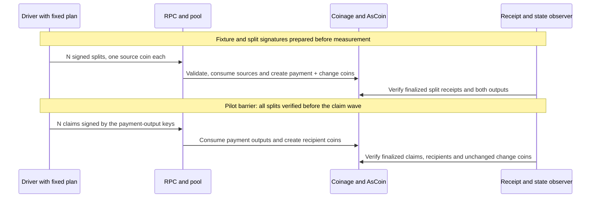

# Payment burst (Draft)

Many actors pay at the same time. This loads the send and claim flows together, from the payment plan to the recipient's finalised claims.

**User flows:** [Send](../../coinage/user-flows.md#send) and [Claim](../../coinage/user-flows.md#claim)

**Runtime path:** Split and claim use [coin operations](../../coinage/pallet-components.md#one-coin-transaction-client-to-runtime-and-back); voucher plans use [unload authorization and recycler proofs](../../coinage/pallet-components.md#recycler-load-ring-readiness-and-unload). Exact-coin send has no preparation call.

| Part | This scenario |
| ---- | ------------- |
| **Source** | A population of payers and recipients. |
| **Stimulus** | Each payer sends one payment at the same moment. The inventory gives a mix of exact, split and unload plans. |
| **Environment** | Performance: planned load. Stress: ramp the number of simultaneous payments. Policy: [payment construction](../../coinage/production-policies.md#payment-construction). Android and iOS differ, so each run selects one. |
| **Artifacts** | C2.payment, C3.extrinsics, C4.requests, R1.calls, R2.origins, R7.recyclers, N1.pool. IDs are defined in the [artifact catalogue](../../coinage/user-flows.md#component-and-artifact-catalogue). |
| **Response** | Sender preparation lands, memos are delivered and every paid coin is claimed. |
| **Response measure** | Time from payment intent to finalised claim of every coin; partial payments; dropped transactions. |

**Coverage so far:** [Claim burst](claim-burst.md) isolates the recipient transfer step using predefined coins. The split-and-claim pilot below adds sender preparation, and its campaign has run. The scenario is complete only when all three plan types have run and a mixed run measures payment intent to finalised claim:

| Plan type | Sender chain call | Pilot | Status |
| --------- | ----------------- | ----- | ------ |
| Exact coins | None | [Exact-coin plan](#exact-coin-plan) | Chain path covered by claim burst |
| Split | `split` | [Split and claim](#next-pilot-split-and-claim) | Run in the lifecycle campaign |
| Unload | `unload_recycler_into_coins` | [Voucher unload and claim](#next-pilot-voucher-unload-and-claim) | Not run |
| Mix of all three | Selected by the wallet policy | [Payment mix](#payment-mix) | Not run |

**Still to decide:** scale, budgets and the actor profiles, which follow the [profile schema](../profile-schema.md). These wait on the [open questions](../../README.md#open-questions).

## Next pilot: split and claim

**Question:** Does each split preserve value and produce claimable outputs under concurrent load? This pilot adds sender preparation to the existing claim test. It uses a fixed valid plan, not a wallet policy or chat transport.

| Setting | Pilot |
| ------- | ----- |
| Network | Existing PreviewNet engine snapshot, six relay validators and two People collators; zero added delay; pool limits as listed below. |
| Load | One-actor smoke, then the selected payment count from the campaign below. |
| Inventory | One age-0 coin of exponent `2` per payer; four fresh keys per actor: source, payment output, change and recipient. |
| Plan | Split into two exponent-`1` coins. Claim the payment output into the recipient; keep the change coin. |
| Calls | N `split` calls followed by N `transfer` calls. Both use `AsCoin`; each is signed by the coin it consumes. |
| Timing | Launch target: 1 s through 20k, 5 s at 40k, 10 s at 100k. Observation deadline per wave: 10 min through 10k, 30 min above 10k. No automatic retries. |

Provision the sufficient instance and backing outside measurement, using the claim pilot's root-seeded fixture. Check exponent bounds, `MaxSplitOutputs >= 2` and all empty destinations before starting. The one-actor smoke must confirm that both operations pass the selected runtime's age checks. Record the bypass of issuance; it is not a full wallet test.

The barrier deliberately separates the two waves. It does not reproduce the apps' asynchronous memo handoff. Claim signing and the split audit occur between waves; report them separately from submission-to-receipt timing. Total completion time starts at the first split submission and ends at the last claim receipt.

**Required evidence and checks:**

- Verify each split's raw extrinsic, finalized block/index, `System.ExtrinsicSuccess` and `Coinage.CoinSplit`. Check the event's instance and two-output count.
- Before claims, require the source absent and both output coins present in the correct instance, with exponent `1` and age `1`.
- Verify each claim with `Coinage.CoinTransferred`. After claims, require the payment-output coin absent, recipient at age `2`, and change still at age `1`.
- Check value conservation per actor: `2^2 = 2^1 + 2^1`. Backing remains unchanged. Save raw state responses and addresses so these checks can be repeated.
- Publish payment count and extrinsic count separately. A successful split followed by an unresolved claim is an incomplete payment, not a successful one.
- Preserve per-wave counts, launch windows, p50/p95/max client-observed finality, signed calls, block evidence, resource samples and recovery results. Report missing metrics explicitly.

Stop on a wrong state, unresolved receipt, node failure or 60-second finality stall. A missed launch target fails the burst timing criterion and is recorded as generator-limited. If all split receipts and state checks pass, continue the claim wave to measure the complete payment; this does not turn the timing failure into a pass. Observe continued finality and both collators after the pilot.

This tests output creation and dependent claims. Voucher unloads, person proofs, production coin selection and shared recycler contention remain outside its scope. The [runtime split and transfer implementation][pilot-runtime] defines the path; the executed runtime metadata and binary revisions must also be recorded.

[pilot-runtime]: https://github.com/paritytech/individuality-community/blob/b5951a9784bdcc87539b793ed686fa6ae93f99ab/pallets/coinage/src/lib.rs

## Sequential campaign

Run A (split and claim) at 100, 1,000 and 10,000 actors, then B (recycling) at the same sizes. Keep node pool defaults for these baselines. Never run cases concurrently.

If a 10,000-actor baseline fails, run that flow at 8,000 + 2,000 with the default pool, then retry 10,000 as one burst with an enlarged pool. The second paced group is released only after the first passes its receipt and state checks; recycling also requires ring readiness. Do not retry individual rejected transactions. A setup failure is not a chain-load result.

Then run A at 20,000, 40,000 and 100,000, followed by B at those sizes:

| Actor count | Enlarged pool entry limit | Byte budget |
| --- | --- | --- |
| 10,000 fallback | 11,000 | 262,144 KiB |
| 20,000 | 22,000 | 262,144 KiB |
| 40,000 | 44,000 | 262,144 KiB |
| 100,000 | 110,000 | 262,144 KiB |

Apply pool overrides to both People collators and save their startup arguments. Larger pools are experimental settings, not production defaults. Split-and-claim uses two calls per actor in separate waves; recycling uses one load per actor plus runtime maintenance calls.

Each case has fresh fixture state. Preserve a failed case and continue the sequence, including failures caused by the driver or runner. Distinguish requested, submitted, receipt-verified and ready counts. A CI job that fails before submission does not satisfy the workload attempt; repair the setup and rerun that case. Deadline and launch-window changes are recorded settings, not evidence of a universal capacity ceiling.

Implementation: [campaign workflow](https://github.com/paritytech/polkadot-pop-e2e/blob/feat/th-coinage-lifecycle-pilots/.github/workflows/coinage-lifecycle-campaign.yml), [driver and evidence guide](https://github.com/paritytech/polkadot-pop-e2e/blob/feat/th-coinage-lifecycle-pilots/ci/previewnet/lifecycle-pilots.md).

Observed outcomes: [lifecycle campaign results](../lifecycle-campaign-results.md). This records original attempts, reruns and evidence limits separately.

## Exact-coin plan

An exact-coin payment has no sender-side chain call. The sender hands whole coins to the recipient, and the recipient claims each one with `transfer`. On chain this is the claim burst's workload, so no separate exact-coin pilot is needed. What claim burst does not cover is the wallet deciding that an exact cover exists; that decision is exercised in the [payment mix](#payment-mix).

## Next pilot: voucher unload and claim

**Question:** Can many payers create payment coins from vouchers at once, and can recipients claim them? This adds the third sender path. It is the first pilot to submit an unload, so it also measures proof generation.

| Setting | Pilot |
| ------- | ----- |
| Network | Same as the split pilot, plus people from the [shared unload fixture](../unload-fixture.md). |
| Load | One-payer smoke, then 100, 1,000 and 10,000 payers on the default pool. Larger sizes follow the [sequential campaign](#sequential-campaign) pool table only after 10,000 passes. |
| Inventory | One exponent-`2` voucher per payer in a built ring of one sufficient instance; one free token per payer; three fresh keys per payer: payment output, change and recipient. |
| Plan | Unload the voucher into two exponent-`1` coins: the payment output and the change. Claim the payment output into the recipient. |
| Calls | N `unload_recycler_into_coins` calls with one alias each, `split_into = [(1, [payment, change])]` and `max_fee = 0` under `AsUnloadTokenPeople` ([call][unload-into-coins]). Then N `transfer` calls under `AsCoin`. |
| Timing | Same launch targets and observation deadlines as the split pilot. Proofs are generated before release. No automatic retries. |

Use a barrier between the two waves, as in the split pilot: all unloads verified before the claim wave. The barrier is a pilot control, not app behaviour.

**Required evidence and checks:**

- Everything in the fixture's [checks for every unload](../unload-fixture.md#checks-for-every-unload), with `Coinage.RecyclerUnloadedIntoCoins` as the call event and `output_count = 2`.
- Before claims, both outputs exist in the right instance with exponent `1` and age `1`. Unloaded coins start at age 1.
- After claims, the payment output is absent, the recipient holds exponent `1` at age `2` and the change coin is untouched.
- Value conservation per payer: `2^2 = 2^1 + 2^1`. Instance backing is unchanged, because the value stays inside Coinage.
- Proof generation results from the fixture, per payer and in total.
- Publish payer count, unload count and claim count separately. An unload with an unresolved claim is an incomplete payment.

Stop on a wrong state, unresolved receipt, node failure or a 60-second finality stall. A missed launch target is generator-limited. Observe continued finality and both collators after the pilot.

## Payment mix

**Question:** With a real wallet policy choosing the plan, how long does a payment take from intent to the recipient's last finalised claim?

This run uses the wallet module's planner (C2) for one selected platform, because Android and iOS differ in split-coin and voucher selection ([payment construction](../../coinage/production-policies.md#payment-construction)). Give each payer an inventory that leads that policy to one known plan type. Use a controlled mix, such as one third exact, one third split and one third unload. Check before release that the planner produces the intended plan for every payer.

- Deliver memos through a controlled in-process transport, with no barrier between sender preparation and claim. Recipients start their claim pass when the memo arrives and claim the coins already visible, as the apps do.
- Measure per payment: intent to memo handoff, intent to sender preparation finality and intent to last finalised claim. Report each plan type separately and together.
- Count partial payments: some coins claimed and some not by the deadline.
- Count dropped or rejected transactions by plan type and by reason.

The mix is a performance run at a stated size. Its stress variant ramps the number of simultaneous payments with the same mix until a response measure fails.

[unload-into-coins]: https://github.com/paritytech/individuality-community/blob/fce93ef38a15c673a8b0b208362bc46ae755c7d7/pallets/coinage/src/lib.rs#L3540-L3552
