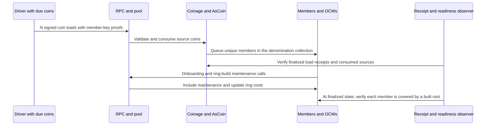

# Synchronised recycling (Draft)

Many coins reach the forced recycling age at the same time. This loads the recycling flow: one recycler load per coin, then ring builds for the new vouchers.

**User flow:** [Recycling](../../coinage/user-flows.md#recycling)

**Runtime path:** [Coin consumption, recycler loading and later Members OCW calls](../../coinage/pallet-components.md#recycler-load-ring-readiness-and-unload). This is distinct from [expired-state cleanup](../../coinage/pallet-components.md#ocw-cleanup-and-archive-recovery).

| Part | This scenario |
| ---- | ------------- |
| **Source** | A population whose coins age together. |
| **Stimulus** | Many coins reach the forced recycling age in the same evaluation window. |
| **Environment** | Performance: planned recycling rate. Stress: ramp the number of coins due at once. Policy: [recycling-unavailable handling](../../coinage/production-policies.md#recycling-unavailable-handling). Android and iOS differ, so each run selects one. |
| **Artifacts** | C2.recycle, R1.calls, R2.origins, R3.rings, R6.pots (sponsored instances), R7.recyclers, N1.pool. IDs are defined in the [artifact catalogue](../../coinage/user-flows.md#component-and-artifact-catalogue). |
| **Response** | Each due coin is loaded into a recycler and its voucher joins a ring. |
| **Response measure** | Recycle loads included; ring build lag; time until the new vouchers are usable. |

**Still to decide:** scale, budgets and the actor profiles, which follow the [profile schema](../profile-schema.md). These wait on the [open questions](../../README.md#open-questions).

**Coverage so far:** the coin-load pilot below has run. It covers concurrent loads and ring readiness, but not the full scenario:

| Part of the scenario | Pilot | Status |
| -------------------- | ----- | ------ |
| Concurrent coin loads and ring readiness | [Coin loads into one recycler collection](#next-pilot-coin-loads-into-one-recycler-collection) | Run; the 100,000 case is incomplete |
| Coins selected by age under a platform policy | [Forced-age selection and voucher use](#next-pilot-forced-age-selection-and-voucher-use) | Not run |
| New vouchers usable | [Forced-age selection and voucher use](#next-pilot-forced-age-selection-and-voucher-use) | Not run |
| Sponsored instance (`R6.pots`) | [Sponsored-instance variant](#sponsored-instance-variant) | Not run |

## Next pilot: coin loads into one recycler collection

**Question:** Can concurrent coin loads complete and their members reach built rings, without lost value or stalled maintenance? Unlike independent claims, these calls share a denomination's recycler collection and cause Members work.

| Setting | Pilot |
| ------- | ----- |
| Network | Existing PreviewNet engine snapshot, six relay validators and two People collators; real Members OCWs; zero added delay; pool limits as listed below. |
| Load | One-actor smoke, then the selected source-coin count in a fresh instance. |
| Inventory | One exponent-`1`, age-0 coin and a unique voucher member key per actor; all actors use the same sufficient instance and denomination. |
| Call | One `load_recycler_with_coin` per source, signed with `AsCoin`. Member-key ownership proof signs the encoded source account. |
| Timing | Launch target: 1 s through 20k, 5 s at 40k, 10 s at 100k. Observation deadline per group: 10 min through 10k, 30 min above 10k. No automatic retries. |

This first pilot overrides the wallet's scheduling decision by marking every fixture coin due at release. Coin age measures operations, not elapsed time; the driver does not wait for coins to age or claim to test either app's age threshold. Coin loading itself has no maximum-age restriction. Record this as a test-owned scheduling override, not a production policy result.

Provision and verify the fixture outside measurement: create the sufficient instance and the denomination's recycler collection, seed the source coins with explicit backing, and prepare fresh voucher keys, ownership proofs and signed loads. Enable ring-build workers and provide their required cryptographic data. Reuse the top-up readiness observer. Do not seed voucher membership or ring roots.

**Required evidence and checks:**

- Verify raw extrinsic hashes, finalized block/index, `System.ExtrinsicSuccess` and `Coinage.RecyclerLoadedWithCoin`, including instance and denomination.
- Check every source coin is absent and every expected member is associated with the intended recycler collection. Backing remains unchanged: these loads consume existing coins rather than deposit new external assets.
- For chain readiness, locate each member and check that its position is below `RingKeysStatus.included` with a built root for that ring. Save the finalized block, collection/ring identifiers, member position, inclusion count and root evidence. Presence in `RingKeys` alone is insufficient.
- Report load finality and ring readiness separately. Readiness is first observed at a finalized poll and includes polling delay; it is not the exact ring-build execution time or the wallet's privacy delay.
- Readiness percentiles cover only observed-ready fixture members. Report their denominator, total submitted members, last observation cutoff and unresolved count. An unobserved member is not a proven failure.
- Save pool/OCW observations and per-process resource samples where available. Measure how long maintenance continues after the last load. Mark unavailable authoring, PVF or pool metrics explicitly.

Pass the pilot only when every load has a verified receipt, every source is consumed, backing matches and all fixture members have observed ring readiness before the deadline. A deadline with missing readiness is incomplete evidence and fails the pilot's completion criterion; it does not establish that the member will never become ready. Stop this case on an incomplete or wrong outcome, preserve evidence, and check network recovery and both collator authors. The campaign still proceeds to its next independent case.

The pilot ends at chain readiness. It does not unload vouchers, consume free unload quotas, test wallet privacy delays or exhaust sponsored deposits. Those remain separate cases in [free-quota exhaustion](free-quota-exhaustion.md) and [offboarding](offboarding-burst.md). The [runtime coin-load path][pilot-runtime] is the source reference; record the actual executed runtime as well.

[pilot-runtime]: https://github.com/paritytech/individuality-community/blob/b5951a9784bdcc87539b793ed686fa6ae93f99ab/pallets/coinage/src/lib.rs

## Sequential campaign

Run A (split and claim) at 100, 1,000 and 10,000 actors, then B (recycling) at the same sizes. Keep node pool defaults for these baselines. Never run cases concurrently.

If a 10,000-actor baseline fails, run that flow at 8,000 + 2,000 with the default pool, then retry 10,000 as one burst with an enlarged pool. The second paced group is released only after the first passes its receipt and state checks; recycling also requires ring readiness. Do not retry individual rejected transactions. A setup failure is not a chain-load result.

Then run A at 20,000, 40,000 and 100,000, followed by B at those sizes:

| Actor count | Enlarged pool entry limit | Byte budget |
| --- | --- | --- |
| 10,000 fallback | 11,000 | 262,144 KiB |
| 20,000 | 22,000 | 262,144 KiB |
| 40,000 | 44,000 | 262,144 KiB |
| 100,000 | 110,000 | 262,144 KiB |

Apply pool overrides to both People collators and save their startup arguments. Larger pools are experimental settings, not production defaults. Split-and-claim uses two calls per actor in separate waves; recycling uses one load per actor plus runtime maintenance calls.

Each case has fresh fixture state. Preserve a failed case and continue the sequence, including failures caused by the driver or runner. Distinguish requested, submitted, receipt-verified and ready counts. A CI job that fails before submission does not satisfy the workload attempt; repair the setup and rerun that case. Deadline and launch-window changes are recorded settings, not evidence of a universal capacity ceiling.

Implementation: [campaign workflow](https://github.com/paritytech/polkadot-pop-e2e/blob/feat/th-coinage-lifecycle-pilots/.github/workflows/coinage-lifecycle-campaign.yml), [driver and evidence guide](https://github.com/paritytech/polkadot-pop-e2e/blob/feat/th-coinage-lifecycle-pilots/ci/previewnet/lifecycle-pilots.md).

Observed outcomes: [lifecycle campaign results](../lifecycle-campaign-results.md). Load receipts and observed ring readiness are separate results.

## Next pilot: forced-age selection and voucher use

**Question:** When many coins cross the forced-recycling age together, does the selected policy pick exactly those coins, do their loads complete, and can the new vouchers then be unloaded?

The coin-load pilot loaded every fixture coin. This pilot puts the selection back. It seeds coin ages directly, because age counts operations rather than time, and reaching age 14 through real transfers would take 14 transactions per coin.

| Setting | Pilot |
| ------- | ----- |
| Network | Same as the coin-load pilot, plus people from the [shared unload fixture](../unload-fixture.md) for the use stage. |
| Load | One-actor smoke, then 1,000 and 10,000 actors on the default pool. Larger sizes follow the campaign pool table after 10,000 passes. |
| Inventory | Per actor, four exponent-`1` coins seeded at ages `13`, `14`, `15` and `0`. `MaximumAge` is `16`, so both apps' forced threshold is `MaximumAge - 2 = 14`. The age-13 and age-0 coins are controls. |
| Policy | Select Android or iOS for `wallet.recycling.unavailable_handling`. Disable discretionary privacy-preset verdicts, so only the forced-age guard selects coins. Keep the free-token allowance above the 20% reserve. |
| Selection | At one controlled evaluation time, run the selected policy over every actor's coins. Expected result: the age-14 and age-15 coins are `MUST_RECYCLE`; the age-13 and age-0 coins are not selected. |
| Load stage | Submit one `load_recycler_with_coin` per selected coin, without waiting between them. |
| Use stage | After readiness, unload a fixed sample of the new vouchers with free tokens: `unload_recycler_into_coin` with one alias each, into a fresh key. Use 1,000 vouchers, or all of them below 1,000. |

**Required evidence and checks:**

- The selection matches the expected set exactly. Report selected, expected, wrongly selected and wrongly skipped coins.
- All checks from the coin-load pilot for every submitted load.
- Control coins are untouched: still present, with unchanged age.
- For the use stage, the fixture's [unload checks](../unload-fixture.md#checks-for-every-unload) with `Coinage.RecyclerUnloadedIntoCoin`, and the output coin present at age `0`.
- Report three times separately: load submission to load finality, load finality to observed ring readiness, and readiness to first successful unload finality. The last one is "time until the new vouchers are usable" in chain terms. It does not include the wallet's privacy delay.

The use stage generates ring-VRF proofs against a ring that may still receive members from later loads. Keep loads stopped during the use stage and record any `InvalidRecyclerRevision` rejections.

## Sponsored-instance variant

Repeat the forced-age pilot's load stage on a sponsored instance (`create_sponsored_instance`). Fund its pot with `fund_pot` for every expected load plus a 10% margin. The deposit per loaded key is `CoinageLoadDeposit`, `7` native units in this runtime ([config][load-deposit]); read it at the starting block.

- Check one held deposit per loaded key and the pot's remaining balance after the stage.
- In the use stage, check that each unload settles its deposits ([settlement][settle-deposits]).
- Running out of pot collateral is a separate case: [sponsored-pot exhaustion](sponsored-pot-exhaustion.md).

## Incomplete 100,000 case

The 100,000-actor coin-load case ended incomplete: 60,990 verified receipts and 39,917 members observed ready by the deadline, with three blocks missing from saved raw evidence. Before rerunning it, save every finalized block body during the stage rather than only receipt blocks. Extend the readiness deadline past the 30 minutes used, and say so in the result. A rerun is a new attempt; it does not replace the original result.

[load-deposit]: https://github.com/paritytech/individuality-community/blob/fce93ef38a15c673a8b0b208362bc46ae755c7d7/runtimes/next-people-paseo/src/people.rs#L1638-L1639
[settle-deposits]: https://github.com/paritytech/individuality-community/blob/fce93ef38a15c673a8b0b208362bc46ae755c7d7/pallets/coinage/src/pot.rs#L427
