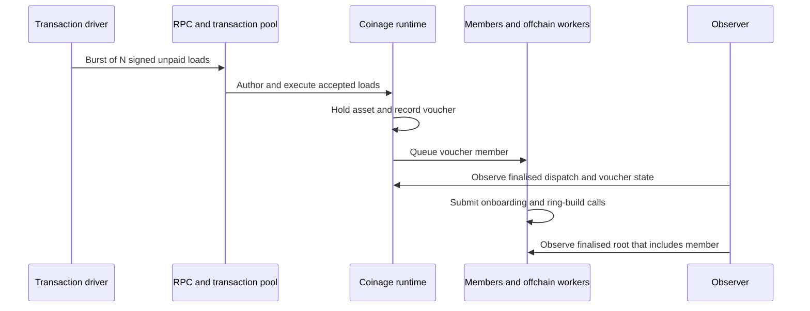

# Top-up burst (Draft)

Many actors top up at the same time. This loads the onboarding flow: each top-up becomes voucher loads, and the chain must add every new voucher to a ring.

**User flow:** [Top-up / Onboarding](../../coinage/user-flows.md#top-up--onboarding)

**Runtime path:** [Recycler loading and member-ring construction](../../coinage/pallet-components.md#recycler-load-ring-readiness-and-unload). A sponsored instance also uses [load-deposit accounting](../../coinage/pallet-components.md#instances-and-sponsored-deposits).

| Part | This scenario |
| ---- | ------------- |
| **Source** | A population of actors whose top-up trigger fires together. |
| **Stimulus** | Each actor tops up its target amount at the same moment. |
| **Environment** | Performance: planned load. Stress: ramp the number of simultaneous top-ups. Policy: [top-up composition](../../coinage/production-policies.md#top-up-composition) (Android and iOS agree). Select the submission shape: iOS batches loads, Android sends one load per voucher. |
| **Artifacts** | C2.topup, C4.requests, R1.calls, R2.origins, R3.rings, R6.pots (sponsored instances), R7.recyclers, N1.pool. IDs are defined in the [artifact catalogue](../../coinage/user-flows.md#component-and-artifact-catalogue). |
| **Response** | Loads are included and finalised. New vouchers join a built ring revision. |
| **Response measure** | Loads finalised versus submitted; pool rejections by reason; time until the new vouchers are in a built ring revision. |

## First run: one load per actor

Use a transaction driver with fixed inputs. Each actor submits one `load_recycler_with_external_asset_unpaid`. This tests the chain path without a wallet planner. It does not establish full app capacity or compare iOS with Android.

The following are proposed pilot settings, not agreed performance budgets:

| Setting | First run |
| ------- | --------- |
| Network | Owned local relay chain and People parachain, with real offchain workers and ring builds. Record node binaries, runtime hash, hardware, topology and pool limits. |
| Instance | One `Sufficient` instance. Record its asset, asset unit and instance ID. Sponsored-pot exhaustion is a later variant. |
| Inputs | One fresh asset account and voucher key per actor; no initial coins or vouchers. Use exponent `1` if supported: each account loads `2 × asset_unit`, with `Expendable` preservation. |
| Load | Smoke run: 1 actor. Then 10, 100, 200, 400, 800 and 1,000 actors. Stop at the first limit below. This cap limits the pilot; reaching it does not establish maximum capacity. |
| Arrival | Release all prepared transactions within a target window of 1 second. Record the actual send window and client concurrency limit. Do not wait for inclusion before sending the next transaction. |
| Observation | After the burst, observe for up to 10 minutes. Track finalised loads and ring readiness separately. This is a run timeout, not a latency target. |
| Repeatability | Restore the same prepared network snapshot before each stage. Record the fixture seed identifier, starting block and actor count. Keep private keys out of results. |

### Setup and validity gate

Complete setup outside the measured window:

1. Provision the asset and instance, including the Coinage pallet account's required asset balance. Fund each actor with its load amount and ensure account creation succeeds. The [existing bootstrap][bootstrap] is a reference for this setup.
2. Enable the offchain workers and install the cryptographic chunks needed for ring builds. Record the effective ring capacity and build limit; do not infer capacity from the ring exponent alone.
3. Build calls against the selected runtime metadata. Include `instance_id`, the account nonce, the `InfallibleUnpaidSigned` extension and the account signature. Each voucher also needs a member-key proof of ownership over the encoded asset account. This path needs no personhood or unload-token proof. See the [runtime integration test][unpaid-test].
4. Complete the one-actor smoke run through successful finalised dispatch and a built ring containing its member. Check asset debit and voucher storage. Only then start the ramp from a clean snapshot.

Prepare keys, proofs and signed transactions before the burst. Set transaction mortality to cover the run and record it. Do not retry rejected or timed-out transactions during the measured stage: retries would change the offered load.

### Trace and observation

Maintenance calls also pass through the pool and consume block capacity. The two observations are independent. Load finality does not imply ring readiness. For readiness, locate the voucher's member in its instance's recycler collection and confirm that its position is included in a built root at a finalised block. Finding the key in `RingKeys` alone is insufficient; check `RingKeysStatus.included` and the root revision. See [Members storage][members]. This measures chain readiness, not a wallet's privacy threshold or delay.

| Measure | Record |
| ------- | ------ |
| Offered load | Actors scheduled, sends attempted, actual send timestamps, RPC acknowledgements and errors. Report attempted transactions per second. |
| Transaction outcome | Hash, actor ID, inclusion and retraction events, finality, dispatch result, rejection/drop reason where exposed, and unresolved transactions at timeout. RPC acceptance is not success. |
| Latency | Send to successful finality; send to ring readiness; finality to ring readiness. Report p50/p95/max with completed and unresolved counts. |
| Chain load | Pool ready/future counts, block weight/proof-size use, block and finality progress, node CPU/memory, member queue backlog and ring-build progress. Mark unavailable metrics explicitly. |
| Generator load | Driver CPU/memory, signing preparation time, RPC latency and actual send window. A missed arrival target makes the stage generator-limited. |
| Recovery | Time from the last send until tracked transactions settle and successful vouchers have built roots. Report remaining pool and member backlog at timeout. |

### Stop and report

- Stop increasing load at the first rejection, unresolved transaction or ring backlog at timeout. Keep observing until the stage deadline so the report includes recovery.
- Abort the ramp on a dispatch failure, invalid signature, stale metadata or insufficient fixture funding. Diagnose these before calling the result a capacity limit. Also stop on node failure or 60 seconds without finality progress; this is an operator guard, not a production service target.
- If the generator misses the one-second arrival target, report the load actually delivered. Fix or scale the generator before claiming a chain limit.
- Save the run configuration, per-transaction outcomes, per-stage summary and node metrics/logs. State the highest completed stage, the first limiting stage and any unobserved outcomes. Do not assume that the pool fails first.

## Driver work needed

Put the driver in `polkadot-pop-e2e`. Keep scheduling and reporting separate from transaction construction so a production-library adapter can supply transactions later.

The inspected `polkadot-pop-e2e` main revision at `d51a470` has generic signing and RPC helpers, but no Coinage driver. Its [`submitAndWatchBestBlock`][tracker] stops at best-block inclusion; it must not be used as the finality or dispatch-success measurement. The old Triangle branch at `5bbfc3b` provides [member-key and ownership-proof helpers][helpers], but its extension defaults and recycler queries target older runtime interfaces. Port only what the smoke run needs, including instance-aware queries and a finality tracker. The current unpaid-load signature path still needs verification on the selected local network.

After this baseline works, add multiple denominations per actor to compare single loads with runtime-bounded batches. Then add sponsored instances with an explicit pot budget. Broader actor profiles remain in the [profile schema](../profile-schema.md); performance targets remain [open questions](../../README.md#open-questions).

[bootstrap]: https://github.com/paritytech/individuality-community/blob/fce93ef38a15c673a8b0b208362bc46ae755c7d7/scripts/initial-setup/03f-setup-coinage.sh
[unpaid-test]: https://github.com/paritytech/individuality-community/blob/fce93ef38a15c673a8b0b208362bc46ae755c7d7/runtimes/next-people-paseo/src/integration_tests/coinage_infallible_unpaid_load.rs
[members]: https://github.com/paritytech/individuality-community/blob/fce93ef38a15c673a8b0b208362bc46ae755c7d7/pallets/members/src/lib.rs
[tracker]: https://github.com/paritytech/polkadot-pop-e2e/blob/d51a470cfb4fb777f2ac7740c44eefca768b8c75/packages/chain-tests/src/lib/tx.ts
[helpers]: https://github.com/paritytech/triangle-e2e/blob/5bbfc3b3991b68eefe7daa4db3680146af7c59ad/packages/chain-tests/src/lib/coinage.ts
