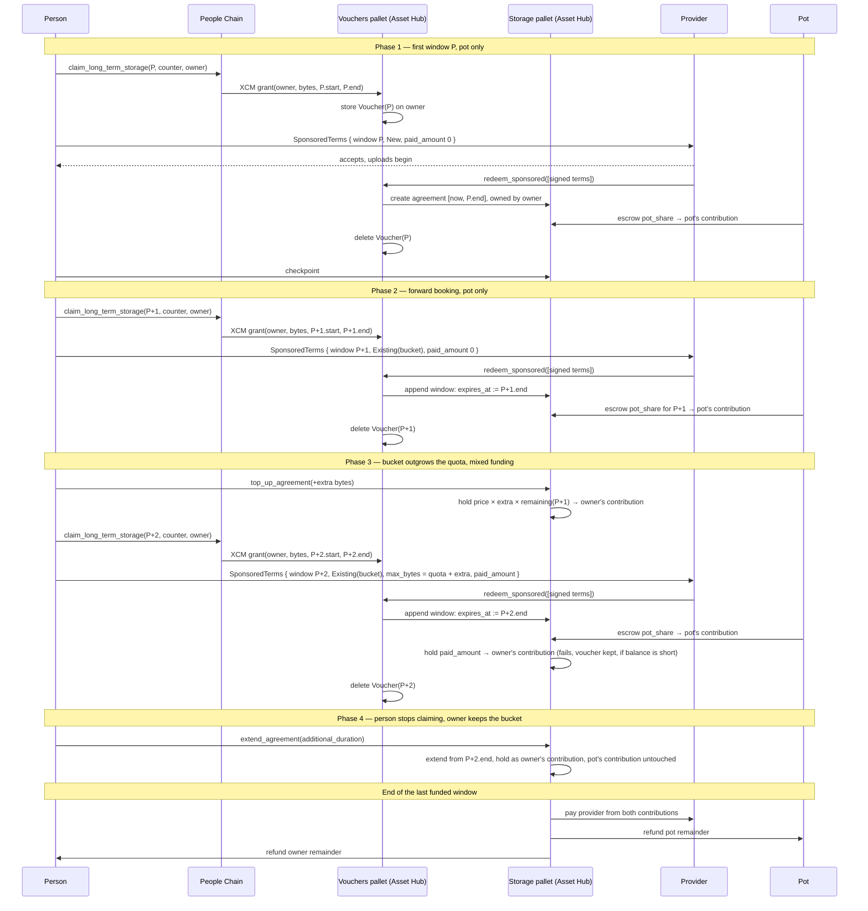

# Personhood Free Tier

|                 |                   |
| --------------- | ----------------- |
| **Start Date**  | 2026-09-08        |
| **Description** | Voucher system to give People a free tier for using Capacity |
| **Authors**     | Francisco Aguirre |
| **Relates to**  | [Web3 Storage - Issue #43](https://github.com/paritytech/web3-storage/issues/43), [Bulletin Chain - Authorization Slots](https://github.com/paritytech/polkadot-bulletin-chain/pull/509), [People Chain - Authorization Slots](https://github.com/paritytech/individuality/pull/931) |

## Summary

Levity gives people with devicehood or personhood a free storage quota through authorizations.
The storage is not really free: the treasury pays Levity collators through the system collators bounty.
Capacity has no equivalent, so it cannot replace Levity until it has one.

This document adds a free tier to Capacity through **vouchers**.
A person claims a voucher on People Chain, exactly as they claim a Levity authorization today.
The voucher lands on Asset Hub, where a storage provider redeems it against a **sponsorship pot** funded by the treasury.
The person owns the resulting bucket, and can grow it or keep it past the free tier by paying, without migrating.

The design does not change how paid storage on Capacity works.

## Motivation

Levity was designed for ephemeral storage and works on authorizations: it has no concept of payment.
Capacity is the long-term storage solution and works on payments: it has no concept of authorizations.
Bringing payments into Levity would mean adding a whole billing model to a chain built without one.
Bringing a free tier into Capacity only means someone other than the owner pays for an agreement, which the rest of this document sets up.

To fully replace Levity, Capacity needs a free tier that gives people what Levity gives them today, with a clear path to paying for more.

### Goals

- People with devicehood or personhood get a small bucket per Product, as with Levity.
- Vouchers add no latency to storing data. The chain stays out of the upload path.
- A free bucket has an easy upgrade path: the owner pays for more space or more time without moving data.
- The sponsorship pot is funded in a sensible way and cannot be drained by a few providers.

### Non-goals

- Specifying how to use Capacity while paying.
- Sybil resistance beyond what devicehood and personhood provide.

## Stakeholders

- Individuality team (People Chain)
- Storage team (Levity, Capacity)
- Mobile team (Polkadot App)
- Applied Engineering (Polkadot Web, Polkadot Desktop)

## Explanation

### Terminology

- **Person**: someone with devicehood or personhood on People Chain, i.e. a member of the People or LitePeople ring.
- **Owner**: the account a voucher is granted to. It owns the bucket and signs the terms. The person picks it freely, one per Product.
- **Provider**: a Capacity storage provider, staked on Asset Hub.
- **Voucher**: a claim on the sponsorship pot for a fixed number of bytes over a fixed window.
- **Window**: a 14-day People Chain period, expressed as a relay-chain block range `(starts_at, expires_at)`. Roughly 201,600 relay blocks.
- **Pot**: the sponsorship pot, a pallet-derived account on Asset Hub that pays providers for vouchers.
- **Sponsor**: any account that funds an agreement it does not own. In this design the sponsor is always the pot.
- **Sponsored agreement**: a Capacity storage agreement whose escrow comes partly or fully from a sponsor.

Bucket, storage agreement, checkpoint, `payment_locked`, `ProviderSettings`, `top_up_agreement`, `extend_agreement`, `AnchorBlockNumber`, and Primary and Replica providers are defined in the canonical Capacity design, linked under [References](#prior-art-and-references).

### Funding model: the sponsorship pot

Providers expect to be paid per agreement, unlike Levity collators, who are paid through a bounty.
"Free" is therefore a funding question: someone other than the owner has to fund the agreement.
That someone is the pot.

The pot is a pallet-derived account in the vouchers pallet.
It is funded first by a referendum and later by a bounty, mirroring how Levity is funded today through the system collators bounty.
The pot pays providers directly when a voucher is redeemed.
It only ever pays for the bucket. The owner stays the owner.

#### What the pot pays

The pot pays at most a governance-set price per byte, `SponsorshipPriceCap`:

```
pot_share = voucher_bytes × min(price_per_byte, SponsorshipPriceCap) × window_length
```

If a provider quotes above the cap, the difference is the owner's to pay through `paid_amount` (see [Redemption](#redemption)), or the provider declines.
Which `price_per_byte` the pot should accept is open: the one the provider announces in `ProviderSettings`, or a separate sponsored price. See [Unresolved Questions](#unresolved-questions).

#### How much the pot needs

The cap bounds the pot's cost per period:

```
max_cost_per_period = active_people × claims_per_period × bytes_per_claim × window_length × SponsorshipPriceCap × 2
```

The trailing `× 2` accounts for forward claiming: pot funds are escrowed when a voucher is redeemed, which for a forward claim is a full window before they are used.

To keep free tier users from losing data, the pot should always hold more than two periods of projected cost.
Below that reserve, the pallet stops accepting redemptions that create new agreements and keeps funding redemptions that extend existing ones.
If the pot cannot cover `pot_share` at all, redemption fails and the voucher is kept until it expires.
Providers could serve optimistically and hold the signed terms until the pot is refilled, but vouchers expire with their window. See [Unresolved Questions](#unresolved-questions).

Governance parameters of the vouchers pallet:

| Parameter | Meaning |
| --- | --- |
| `SponsorshipPriceCap` | Maximum price per byte the pot pays. |
| `ExposureCapPerStakeUnit` | How much outstanding pot escrow a provider may hold per unit of stake. See [Exposure cap](#exposure-cap). |
| `MaxSlots` | Maximum vouchers per owner. Two in practice: the current window and one forward window. |

The bytes granted per voucher are not an Asset Hub parameter. People Chain decides them per ring, see [Claims for Capacity](#claims-for-capacity).

### Owner and sponsor refactor

Today a storage agreement has one funder, its owner, and one `payment_locked`.
A third party can fund an agreement, but only as a gift: the funds move to the owner's account and are held there.
That is right for anyone funding an open bucket, and wrong for a sponsored bucket:

- Refunds from a sponsored bucket must not go to the owner.
- The owner must not be able to burn the sponsor's funds.

`StorageAgreement` therefore tracks two funders: the owner and one optional sponsor, each with its own hold.
Settlement pays the provider from both holds.
Refunds go back to whichever funder they came from.
Burns only touch the owner's hold.
The single-funder case is unchanged.
One sponsor per agreement is enough. Several accounts that want to sponsor one bucket can do so through a smart contract.

The lifecycle section below calls the two holds the **pot's contribution** and the **owner's contribution**.

### How claims work today (People Chain to Levity)

This design assumes the [authorization slots PR](https://github.com/paritytech/individuality/pull/931) is merged. The flow below describes People Chain with it.

People Chain keeps people with devicehood and personhood in rings.
Clock time is split into 14-day periods.
Each period, a person can claim a fixed number of storage slots with `claim_long_term_storage(period, counter, account_id)` from `pallet-resources`:

1. The call carries a ring-VRF membership proof against the People or LitePeople ring.
2. The proof derives a deterministic alias, stored as a nullifier so the same `(period, counter)` cannot be claimed twice.
3. The allowance depends on the ring: `LongTermStorageAllowanceForPeople` or `LongTermStorageAllowanceForLitePeople`.
4. People Chain computes the window of the claimed period and calls `AllocateStorage::allocate_storage(account_id, bytes, count, starts_at, expiration)` on its configured `LongTermStorageDataStore`.
   `starts_at` and `expiration` are relay-chain block numbers. `starts_at = None` means the allocation is active immediately, `Some(block)` forward-books it.
   The current implementation, `BulletinDataStore`, sends an XCM `UnpaidExecution + Transact` to Levity calling `authorize_account_window` with the same arguments.
5. The authorization lasts until `expiration`. A person can also claim `period + 1`, so an authorization can be extended before it lapses. The authorization slots PR names these periods **windows** and describes each as `(starts_at, expires_at)`, which is the terminology this document uses throughout.

Two properties of this flow carry over to Capacity unchanged.
A person can claim several slots and point each at a different account, which is what lets the Polkadot App use one storage account per Product for privacy.
Allowances also expire, so a person has to keep claiming. That is how the system keeps giving storage only to accounts that still belong to a person.

### Claims for Capacity

The People Chain half stays as it is.
A second `AllocateStorage` implementation, `CapacityDataStore`, sits alongside `BulletinDataStore` and sends the same `UnpaidExecution + Transact` shape to Asset Hub, calling the vouchers pallet instead.
The `count` argument, which Levity uses for a transaction quota, has no meaning for Capacity and is ignored.

On Asset Hub, the call creates a voucher for the account with the granted bytes and the window `(starts_at, expiration)` it received. A `starts_at` of `None` becomes the current relay-chain block.
The quota therefore comes from People Chain and differs per ring: full people get more than lite people.
Grants for the same account and window merge into one voucher, as authorization slots do on Levity.

### Voucher data model

```rust
Vouchers: StorageMap<AccountId, BoundedVec<Voucher, MaxSlots>>;

struct Voucher {
  bytes_kib: u32,               // Minimum 1 KiB, maximum 4 TiB
  starts_at: AnchorBlockNumber, // Relay-chain block number, not the parachain's
  expires_at: AnchorBlockNumber,
}

/// Index for garbage collection, see below.
VouchersByWindow: StorageDoubleMap<AnchorBlockNumber /* expires_at */, AccountId, ()>;

/// Outstanding pot escrow per provider, see Exposure cap.
PotExposure: StorageMap<ProviderId, Balance>;
```

A voucher is identified by `(account, starts_at, expires_at)`, never by its position in the vector.
This is unique because same-window grants merge.
The owner shares that identifier with a provider so the provider can redeem it.
Merging is borrowed from authorization slots as an optimization: fewer vouchers to store and garbage-collect.
It may be dropped so that a person can spend one claim on a primary and others on replicas for redundancy. See [Unresolved Questions](#unresolved-questions).

A voucher is redeemed once and then deleted, so no nonce is needed.
A voucher that is never redeemed expires with its window.
`VouchersByWindow` lets the pallet delete every unused voucher for a window when that window ends without iterating through the whole `Vouchers` map.

### Redemption

The owner never touches the chain to use a voucher.
They negotiate with a provider off-chain, sign `SponsoredTerms`, and hand the signature to the provider.
The provider submits it through `redeem_sponsored(Vec<SignedSponsoredTerms>)`, batching several owners' terms in one call, and pays the transaction fee.
This keeps the chain out of the upload path and spares the owner from needing PGAS to get started.

`SponsoredTerms` replaces `AgreementTerms` for sponsored agreements.
It has different fields and is signed by the owner rather than the provider:

```rust
struct SponsoredTerms {
  owner: AccountId,             // voucher holder
  window: VoucherWindow,        // (starts_at, expires_at), identifies the voucher
  provider: AccountId,          // the only provider allowed to redeem it
  target: BucketTarget,         // New | Existing(BucketId) | Replica(BucketId)
  max_bytes: u64,               // quota for the window, may exceed the voucher's bytes
  price_per_byte: Balance,      // provider's quote
  paid_amount: Balance,         // owner's share, see below
  redeem_by: AnchorBlockNumber, // deadline for the provider to redeem, clamped to the window
  replica: Option<ReplicaTerms>, // Replica target only: sync_balance, min_sync_interval, sync_price
}
// signature: MultiSignature by `owner` over blake2_256(SPONSORED_TERM_CONTEXT ++ SCALE(terms))
const SPONSORED_TERM_CONTEXT: &'static str = "sponsored-term-v1:";
```

- `target`:
  - `New` creates a bucket and a sponsored agreement for `[max(now, window.starts_at), window.expires_at]`, owned by `owner`.
  - `Existing(bucket)` appends the window to an agreement the owner already has with this provider: `expires_at` becomes `window.expires_at`. The start time of the agreement is not changed to `now`, so no paid time is lost.
  - `Replica(bucket)` creates a sponsored replica agreement with the given `ReplicaTerms`.
- `max_bytes` may exceed the voucher's bytes. The pot pays `pot_share` for the voucher's bytes at `min(price_per_byte, SponsorshipPriceCap)`. Everything else is the owner's: bytes above the voucher, and any price above the cap.
- `paid_amount` is the owner's share, held as the owner's contribution at redemption. It must cover exactly what the pot does not. It is also how a sponsored bucket grows beyond the voucher's bytes.
- `redeem_by` bounds how long the provider can sit on signed terms before redeeming. It is clamped to the window, but should be a matter of hours, so providers redeem promptly and shorten the window for double redemption.

Redemption fails, and the voucher stays in place, when: the voucher does not exist or has expired, the submitting provider is not `provider`, `redeem_by` has passed, `paid_amount` is short of the owner's share, the owner's balance cannot cover `paid_amount`, the pot cannot cover `pot_share`, the pot is below its reserve and `target` is `New` or `Replica`, or the provider's exposure cap would be exceeded.
On success the agreement is created or extended, both holds are placed, `PotExposure[provider]` grows by `pot_share`, and the voucher is deleted.

### Exposure cap

Nothing stops a person from registering as a provider and redeeming their own vouchers.
Without a limit, every person could extract `claims_per_period × bytes_per_claim × SponsorshipPriceCap × window_length` from the pot each period while storing nothing of value.

`ExposureCapPerStakeUnit` closes this by tying what a provider can draw from the pot to the stake they have locked.
`PotExposure[provider]` is the pot escrow currently sitting in that provider's live sponsored agreements.
Redemption fails if `PotExposure[provider] + pot_share > provider_stake × ExposureCapPerStakeUnit`.
Exposure goes down as sponsored agreements settle or end.

Extracting from the pot therefore requires locking stake in proportion to what is extracted, for as long as the sponsored agreements run.
If the bucket is private, only its members and agreement owners can challenge a primary provider, and a self-dealing person will not challenge themselves.
What limits them is the capital they have to tie up.
`ExposureCapPerStakeUnit` has to be low enough that self-dealing returns less than the same stake earns elsewhere, otherwise the cap only bounds the rate of extraction.
The same limit stops any single large provider from absorbing the whole pot.

### Lifecycle of a sponsored bucket

A sponsored bucket goes through up to four phases. Each can be the last.

1. **First window.** The person claims period `P` on People Chain, a voucher for `P` appears on the owner account. The owner signs `SponsoredTerms { window: P, target: New, paid_amount: 0 }`, the provider accepts and starts taking uploads, then redeems. The agreement runs to `P.end` with the pot share escrowed as the pot's contribution. The owner checkpoints as with any bucket.
2. **Forward booking.** The person claims `P + 1` before `P` ends. The owner signs terms with `target: Existing(bucket)`. Redemption appends the window: `expires_at := (P + 1).end`, and the pot escrows another window as the pot's contribution.
3. **Mixed funding.** The bucket outgrows the quota. The owner calls `top_up_agreement` for the extra bytes, which holds `price × extra × remaining` as the owner's contribution. From then on the agreement has two non-zero contributions. When the person claims `P + 2`, the terms carry `max_bytes = quota + extra` and a `paid_amount` for the extra bytes. Redemption escrows the pot share as the pot's contribution and `paid_amount` as the owner's. If the owner's balance is short, redemption fails and the voucher is kept.
4. **Owner continues alone.** The person stops claiming. The owner calls `extend_agreement`, which extends from `(P + 2).end`, not from `now`, and holds the whole cost as the owner's contribution. The pot's contribution is untouched. Any vouchers the person still claims can go to another bucket.

Phases 3 and 4 are the upgrade path: a free bucket becomes a paid one by topping it up or extending it, ownership never changes, and no data moves.

At the end of the last funded window, the provider is paid from both contributions and any remainder is refunded per contribution: pot remainder to the pot, owner remainder to the owner.
A sponsored agreement can also end early. If the provider is slashed or disappears, the unspent pot share returns to the pot and a fresh voucher for the remaining window is created for the owner, so they can pick another provider without waiting for the next period.
If the owner terminates voluntarily, the unspent pot share returns to the pot and no new voucher is created.



## Drawbacks

- No replication by default. Levity was better here, since every collator stores every blob.
- Much more on-chain activity per free tier user than Levity: a bucket, an agreement, redemption, checkpoints.
- The owner still needs PGAS to checkpoint unless providers are allowed to checkpoint on the owner's behalf.

## Testing, Security, and Privacy

### Testing

- Every hold on an agreement is either paid to the provider or refunded to the funder it came from, owner or sponsor.
- A voucher is redeemed at most once, including when two providers hold signed terms for it.
- Every redemption failure listed under [Redemption](#redemption) leaves the voucher untouched.
- The pot share never exceeds `voucher_bytes × min(price_per_byte, SponsorshipPriceCap) × window_length`.
- Below the two-period reserve, `New` and `Replica` redemptions fail and `Existing` redemptions succeed.
- `PotExposure[provider]` never exceeds `provider_stake × ExposureCapPerStakeUnit`, and drops when a sponsored agreement settles.
- Redeeming against `Existing(bucket)` appends the window and does not change the start time of the agreement.
- End-to-end: a bucket goes through all four lifecycle phases, including `paid_amount > 0`, without losing data.
- A provider slash refunds the pot and re-issues a voucher for the remaining window. A voluntary owner termination refunds the pot and issues nothing.
- Unused vouchers are deleted when their window ends.

### Security

- **Self-dealing provider.** A person registering as a provider to redeem their own vouchers needs stake in proportion to what they draw. See [Exposure cap](#exposure-cap).
- **Sellable claims.** Claims are feeless and the target account can be chosen freely, so people can sell their allowance. This is true of every allowance People Chain hands out today.
- **Double redemption.** An owner can send signed terms to several providers. Only one can redeem, since the voucher is deleted on first redemption. Providers redeem promptly to limit their exposure to this.
- **Burning the pot.** Prevented by the [owner and sponsor refactor](#owner-and-sponsor-refactor): burns only touch the owner's hold.
- **Hoarding.** Impossible beyond one forward window. Vouchers expire with their window and `MaxSlots` bounds them.

### Privacy

- Using the same `AllocateStorage` flow as Levity keeps the same unlinkability between a person and their storage accounts, and between accounts of the same person, one per Product.
- The provider learns the owner account. Per-Product accounts limit what that reveals.
- Bucket contents are visible to the provider. Private buckets need client-side encryption.

## Performance, Ergonomics, and Compatibility

### Performance

Every free tier claim costs more on Asset Hub than on Levity: the XCM grant, a redemption, and periodic checkpoints.
Batched redemption keeps the per-bucket cost down, and uploads stay off-chain.
Concrete per-window figures are under [Unresolved Questions](#unresolved-questions).

### Ergonomics

For a Capacity user, the free tier is one extra step: claim a voucher, then include its window in the terms negotiated with a provider.

For User Agents (Polkadot Web, Polkadot Desktop, Polkadot App) the change is larger, since they take over what Levity did implicitly, but the experience shown to the user need not change.
The host functions that Products and User Agents need are the subject of the upcoming TrUAPI host functions design.

### Compatibility

- Paid storage is unchanged. Sponsorship is added alongside it.
- No changes to Levity.
- People Chain gains a second `AllocateStorage` implementation. No breaking change beyond what the authorization slots PR already makes.
- Breaking: `StorageAgreement` gains the sponsor's contribution.

## Alternatives Considered

### 1. Keep Levity as the free tier

Levity handles the free tier and Capacity handles paid storage only.
Two disadvantages: the Levity free tier is tight and has little room to grow, and a user who outgrows it has to migrate their data to Capacity.

### 2. Governance-funded sponsor contract

A treasury-funded smart contract establishes agreements through a Capacity precompile, checking eligibility through the personhood precompile.
The contract would own the buckets, which muddies ownership and breaks the upgrade path.

### 3. Owners redeem vouchers themselves

Puts the chain in the hot path and requires every free tier user to hold PGAS before they can store anything.
Letting providers batch redemptions of off-chain signed terms is cheaper and more ergonomic.

## Prior Art and References

- Capacity: [architecture and economics](https://github.com/paritytech/web3-storage/blob/dev/docs/design/scalable-web3-storage.md).
- Capacity: [implementation details](https://github.com/paritytech/web3-storage/blob/dev/docs/design/scalable-web3-storage-implementation.md).
- [Levity authorizations](https://github.com/paritytech/polkadot-bulletin-chain/blob/main/docs/authorizations.md).
- [Individuality's `AllocateStorage` trait (from the authorization slots PR)](https://github.com/paritytech/individuality/blob/504b06c50bea916425de6336186d1055896133ed/support/src/traits/reality.rs#L1026).
- [TrUAPI RFC-0010: Allowance](https://github.com/paritytech/truapi/blob/main/docs/rfcs/0010-allowance.md).

## Unresolved Questions

- Which price the pot accepts: the provider's announced `price_per_byte` from `ProviderSettings`, or a separate `sponsored_price_per_byte`.
- Pricing in dotUSD rather than DOT, since provider costs are in fiat. `SponsorshipPriceCap` would then be denominated in stables.
- When the pot is empty, redemption fails. Providers could serve optimistically and redeem once the pot is refilled, but vouchers expire with their window, so a redemption that failed for lack of funds would need a way to extend the voucher's expiry. How that is bounded is open.
- Owners need PGAS to checkpoint. Should providers be able to submit checkpoints for sponsored buckets instead?
- Concrete values for `SponsorshipPriceCap`, `ExposureCapPerStakeUnit`, `MaxSlots`, the two-period reserve, and the per-ring byte quotas on People Chain. `active_people` in the cost bound is a projection.
- `ExposureCapPerStakeUnit` must make self-dealing a worse return than staking elsewhere. What that value is, and whether it leaves honest providers enough room, is not yet worked out.
- Self-dealing would be less attractive if anyone, not only the owner, could challenge a sponsored bucket, since the stake would then be slashable. But that requires sponsored buckets to be public, and onlookers have no reason to challenge them. Paying challengers a share of the pot would fix the incentive but is a different model.
- Replication for free tier buckets: none in v1. Whether and how to fund a replica from the voucher is open. One option is to stop merging same-window grants, so a person can point one voucher at a primary and two at replicas. That changes how a voucher is identified, since `(account, starts_at, expires_at)` would no longer be unique.
- Per-window on-chain cost per free tier user on Asset Hub. No figures yet.

## Future Directions and Related Material

- Open sponsorship to anyone, not only the pot, e.g. a company funding buckets for its employees. The sponsor's contribution already supports it.
- Split a voucher so half the bytes fund a primary and half a replica.
- Provider-submitted checkpoints for sponsored buckets.
- TrUAPI host functions for the User Agent and Product side of the free tier.
