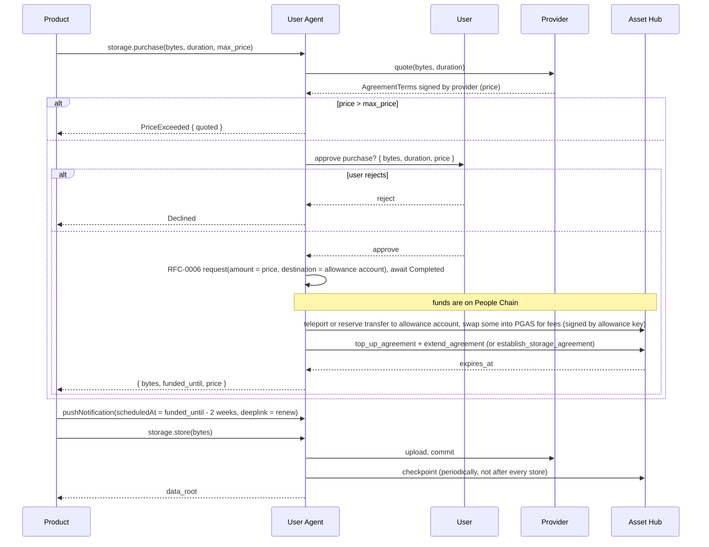

# TrUAPI Host Functions

|                 |                   |
| --------------- | ----------------- |
| **Start Date**  | 2026-09-08        |
| **Description** | Host functions needed for Products to interact with Capacity |
| **Authors**     | Francisco Aguirre |
| **Relates to**  | [Personhood Free Tier](./personhood-free-tier.md), [TrUAPI RFCs](https://github.com/paritytech/truapi/tree/main/docs/rfcs) |

## Summary

Products will want to use Capacity to store images, videos, and other large data.
Products only reach User Agents and the outside world through the TrUAPI, so they need new host functions to use Capacity.
This document proposes those functions.

Capacity has two funding paths, and they need different TrUAPI methods:

- Sponsored (free tier): follows RFC-0010 exactly, with Capacity taking the place of Levity.
- Paid: needs a separate `storage.purchase` request, because the User Agent has to know how many bytes, for how long, and the most the user is willing to pay.
  It also has to ask the user to approve the payment and move the funds to Asset Hub.

Once its contents are agreed, this design will be moved to a TrUAPI RFC, since that is where host functions are specified.
The design stays here and will link to the RFC once it is published.

## Motivation

Levity was built for ephemeral storage, and renewals were added later because Products needed them.
Even with renewals, Levity's quotas are small.
Many Products cannot be built without a storage solution that scales, and Capacity is that solution.
The [Personhood Free Tier](./personhood-free-tier.md) design gives Capacity a free tier so it can replace Levity.
Without TrUAPI changes, Products still cannot reach it.

### Goals

- Writing data to Capacity is as simple as `submit_preimage` is for Levity.
- Products do not need to know about providers or agreements to use Capacity.
- Products can use Capacity's free tier.
- Products can pay for more storage.

### Non-goals

- Letting Products choose their providers. See [Alternatives Considered](#alternatives-considered).
- Replication. Free tier buckets have no replicas in v1, and purchasing replicas is a [future direction](#future-directions-and-related-material).
- Recurring payments.

## Stakeholders

- TrUAPI team
- Storage team (Levity, Capacity)
- Mobile team (Polkadot App)
- Applied Engineering (Polkadot Web, Polkadot Desktop)

## Explanation

### Terminology

- **Product**: an application running inside a User Agent and talking to it through the TrUAPI.
- **User Agent**: Polkadot App, Polkadot Web, or Polkadot Desktop. The TrUAPI RFCs call it the host.
- **Allowance account**: the per-Product account that RFC-0010 hands out with an allowance. It owns the Product's bucket and signs its agreements. Products never see its key.
- **Data root**: the 32-byte content address Capacity returns for stored bytes.
- **Quota**: the bytes a Product may store, whether sponsored or purchased.

Bucket, storage agreement, checkpoint, `MaxChunkSize`, `expires_at`, `establish_storage_agreement`, `top_up_agreement`, and `extend_agreement` are defined in the canonical Capacity design, linked under [References](#prior-art-and-references).

### API changes at a glance

```rust
/// Store bytes in persistent storage. Returns the content's data root.
#[wire(request_id = 164)] // ids are provisional, see Unresolved Questions
async fn store(&self, cx: &CallContext, request: RemoteStorageStoreRequest)
  -> Result<RemoteStorageStoreResponse, CallError<RemoteStorageStoreError>>;

/// Stream the bytes behind a data root this Product stored.
#[wire(request_id = 166)]
async fn read_subscribe(&self, cx: &CallContext, request: RemoteStorageReadSubscribeRequest)
  -> Subscription<RemoteStorageReadSubscribeItem>;

/// Buy persistent storage for this Product, paid by the user. Returns the granted bytes and expiry.
#[wire(request_id = 170)]
async fn purchase(&self, cx: &CallContext, request: RemoteStoragePurchaseRequest)
  -> Result<RemoteStoragePurchaseResponse, CallError<RemoteStoragePurchaseError>>;
```

```rust
RemoteStorageStoreRequest = Vec<u8>; // The content bytes.
RemoteStorageStoreResponse = [u8; 32]; // The data root.
RemoteStorageStoreError = { QuotaExhausted, Unknown { reason } };

RemoteStorageReadSubscribeRequest = { data_root: [u8; 32], offset: u64, length: Option<u64> };
RemoteStorageReadSubscribeItem = { offset: u64, bytes: Vec<u8> }; // One chunk of at most `MaxChunkSize` (256 KiB). The last one may be short.
// `length: None` reads to the end. The stream ends after the last chunk of the range.
// Errors (unknown root, lapsed agreement, verification failure) end the stream following
// the TrUAPI subscription error convention.

RemoteStoragePurchaseRequest = { bytes: u64, duration: Duration, max_price: Balance };
RemoteStoragePurchaseResponse = { bytes: u64, funded_until: Timestamp, price: Balance };
RemoteStoragePurchaseError = { PriceExceeded { quoted: Balance }, Declined, InsufficientFunds, Unknown { reason } };
```

All types are versioned with `versioned_type!`, as every TrUAPI type is.
`Balance` is RFC-0006's `Balance`, in its fixed payment asset.
The representations of `Duration` and `Timestamp` are open. See [Unresolved Questions](#unresolved-questions).

`store` never prompts the user.
It succeeds while the Product has quota, sponsored or purchased, and fails with `QuotaExhausted` otherwise.
Only `purchase` prompts.

RFC-0010's allocatable resources gain a variant for Capacity:

```rust
enum AllocatableResource {
    // ...existing variants. SCALE order is the wire contract, append only.
    CapacityAllowance,
}

// RFC-0010 keeps a parallel `ApAllocatableResource` for the Accounts Protocol boundary.
// It gains the same variant, and `ApAllocatedResource::CapacityAllowance` carries the
// allowance account's key, mirroring `BulletinAllowance { slot_account_key }`.
```

The variant is named after Capacity, while the existing one is named after Bulletin, the chain Levity runs on.

### The sponsored flow

With [Capacity's personhood free tier](./personhood-free-tier.md), Capacity fits the RFC-0010 allowance flow just like Levity does.
The User Agent requests `CapacityAllowance` as it requests `BulletinAllowance` today.
Since no payment is involved, the flow needs no new prompt or payment step.

Each new People Chain period, the User Agent claims a new voucher and negotiates terms against the same bucket, as the free tier design specifies.
This continues for as long as the person keeps proving personhood, or until they cancel renewal.

### The paid flow

A Product that needs a specific amount of storage, for example for a drive or a photo album, says what it needs: bytes, duration, and the maximum price the user may be charged.
The User Agent then takes care of four steps.

1. **Quote**: fetch quotes for `bytes × duration` from providers chosen by its own selection policy.
   Prefer topping up and extending the Product's existing bucket.
   The free tier design allows mixed funding, so a sponsored bucket can be topped up too.
   Whether the User Agent may instead open a new bucket with a cheaper provider is open. See [Unresolved Questions](#unresolved-questions).
   If a Product ends up with several buckets, that is invisible to the Product.
2. **Consent**: show the user one prompt with the bytes, duration, and price.
   This is the RFC-0006 payment confirmation, extended with bytes and duration.
   It is User Agent UI, not a wire type.
   `Declined` means the user rejected it.
3. **Payment**: pay `price` from the user's balance to the allowance account through the RFC-0006 payment layer.
   The User Agent runs this payment itself, reusing the RFC-0006 consent UI, rather than the Product calling RFC-0006.
   The payment goes through coinage so the payment cannot be linked to the user's other accounts.
   The funds land on People Chain and the agreement lives on Asset Hub.
   RFC-0006 cannot deposit on another chain, so the User Agent moves the funds across itself.
   The allowance account also needs PGAS on Asset Hub to sign the agreement extrinsics and later checkpoints. The swap in the diagram covers this.
4. **Agreement**: call `establish_storage_agreement` for a new bucket, or `top_up_agreement` plus `extend_agreement` on the existing one, signed by the allowance account.
   Return the granted bytes and `funded_until`.



Capacity agreements can last much longer than Levity's periods, but they still expire.
Once `expires_at` is reached, the provider is no longer bound to store the data.
`funded_until` is derived from `expires_at` and is returned so the Product can remind the user to renew.
The Product schedules a push notification per RFC-0019 with a deeplink into its own renew flow.
When a later `purchase` moves `funded_until`, the Product cancels the reminder and schedules a new one.
The [Ergonomics](#ergonomics) section shows what this looks like from the Product's side.

## Drawbacks

- Storage purchases need a cross-chain transfer from People Chain to Asset Hub. This adds latency, fees, and a second place the flow can fail.
- Every `store` needs an off-chain upload and, periodically, an on-chain checkpoint paid in PGAS by the allowance account.
- Products have to track `funded_until` themselves to remind the user to renew.
- `read_subscribe` streams chunks of up to 256 KiB across the iframe bridge, one message each.
- If the User Agent may open a bucket with a cheaper provider, a Product can end up with two buckets. The User Agent then keeps a data root to bucket index and renews and checkpoints two agreements.

## Testing, Security, and Privacy

### Testing

- `store` followed by `read_subscribe` over the whole range returns the same bytes.
- Ranged reads return the right bytes.
- The User Agent checkpoints after a configurable number of `store` operations, not after each one.
- A chunk whose proof does not verify is rejected.
- `store` beyond the sponsored quota fails with `QuotaExhausted`. After `purchase` it succeeds.
- After claims stop, purchased quota remains available.
- `purchase` prompts the user. Rejecting the prompt returns `Declined`, and no payment is made.
- A quote above `max_price` returns `PriceExceeded { quoted }` without prompting.
- A purchase for a Product that already has a bucket lands as a top-up, not a new bucket.
- A second `purchase` extends `funded_until` on the same bucket.
- A User Agent without these functions answers `CallError::unavailable()`.

### Security

Products never see the key of the allowance account that owns their bucket and pays for it.
Products do not choose their providers, which prevents provider lock-in and stops a Product from steering user funds to a colluding provider.
The user sees the price and approves every purchase, and `max_price` bounds what the User Agent pays regardless of what a provider quotes, so a Product cannot drain the user's balance.
Every chunk read is verified against the data root, so a provider cannot serve wrong bytes.

### Privacy

Bucket contents are visible to the provider, so Products should encrypt client-side.
Cross-Product unlinkability is preserved by using one allowance account per Product, as with Levity.
The provider learns the allowance account, and per-Product accounts limit what that reveals.
Payments go through coinage, so the provider cannot link a payment to the user's other accounts.

## Performance, Ergonomics, and Compatibility

### Performance

`store` is an off-chain upload to the provider plus a periodic on-chain checkpoint, so the chain stays out of the write path.
`purchase` is several Asset Hub transactions plus a cross-chain transfer, so it takes seconds to minutes and should be rare.
`read_subscribe` streams one message per chunk across the iframe bridge. Whether that is acceptable for large files is open. See [Unresolved Questions](#unresolved-questions).

### Ergonomics

Products store data with one call, as they do with `submit_preimage` today:

```ts
const root = await truapi.storage.store(bytes);
```

The User Agent does the work.

Purchasing is explicit.
Products are encouraged to schedule a reminder so the user knows to renew:

```ts
const { fundedUntil } = await truapi.storage.purchase({ bytes, duration: year, maxPrice });
const reminder = await truapi.pushNotification({ text, deeplink, scheduledAt: fundedUntil - twoWeeks });
```

### Compatibility

The three functions are new.
`AllocatableResource` and `ApAllocatableResource` gain an appended variant, which is a compatible change under RFC-0010's append-only rule.
Whether `BulletinAllowance` is then deprecated is open. See [Unresolved Questions](#unresolved-questions).
User Agents that do not implement these functions answer `CallError::unavailable()`, as for any unsupported method.

## Alternatives Considered

### 1. Route `submit_preimage` to Capacity

Reuse Levity's preimage functions and let the User Agent decide whether the bytes go to Levity or Capacity.
Levity's ephemeral storage and Capacity's persistent storage are two distinct mechanisms, and both are valuable on their own.
A separate `storage` namespace keeps them apart and gives `purchase`, which has no Levity counterpart, a natural home.

### 2. Products choose their providers

Let a Product name the provider it wants, for a particular region or service level.
This forces Products to know about providers, quotes, and agreements, which this design sets out to hide.
It also lets a Product lock the user into a provider or steer user funds to a provider it colludes with.
Rejected for v1. A `preferred_providers` hint that the User Agent may honour is left open. See [Unresolved Questions](#unresolved-questions).

### 3. Use the `chain.*` functions

Products could build everything on the generic chain functions.
They could not use the allowance account, so the free tier would be out of reach.
Every Product would reimplement quoting, payment, agreements, and checkpoints, when the User Agent can do it once for all of them.

### 4. Extend the RFC-0010 allowance to cover paid buckets

`CapacityAllowance` could carry `bytes`, `duration`, and `max_price`.
That conflates a mechanism for handing out free allowances with payment and consent.
Keeping payment in `purchase` leaves the allowance flow untouched and lets it reuse the RFC-0006 consent UI.

## Prior Art and References

- [Personhood Free Tier](./personhood-free-tier.md), the sponsored side of this design.
- Capacity: [architecture and economics](https://github.com/paritytech/web3-storage/blob/dev/docs/design/scalable-web3-storage.md).
- Capacity: [implementation details](https://github.com/paritytech/web3-storage/blob/dev/docs/design/scalable-web3-storage-implementation.md).
- [TrUAPI RFC-0010: Allowance](https://github.com/paritytech/truapi/blob/main/docs/rfcs/0010-allowance.md).
- [TrUAPI RFC-0006: Payments](https://github.com/paritytech/truapi/blob/main/docs/rfcs/0006-payments.md).
- [TrUAPI RFC-0017: Coinage payment](https://github.com/paritytech/truapi/blob/main/docs/rfcs/0017-coinage-payment.md).
- [TrUAPI RFC-0019: Scheduled notifications](https://github.com/paritytech/truapi/blob/main/docs/rfcs/0019-scheduled-notifications.md).
- [TrUAPI RFC-0028: Wire message type](https://github.com/paritytech/truapi/blob/main/docs/rfcs/0028-wire-message-type-byte.md), which governs the wire ids.

## Unresolved Questions

- Does every `read_subscribe` chunk cross the iframe bridge as its own message? Is there a way to avoid that many messages?
- Should the User Agent be allowed to open a second bucket with a cheaper provider, or always top up the existing one? If both, what rule decides?
- How are `Duration` and `Timestamp` represented? Capacity's `expires_at` is a relay chain block number. Products may prefer a timestamp.
- The wire ids are provisional. RFC-0026 already uses `request_id = 166`, and RFC-0028 changes ids to a per-trait sequence.
- Does the first `store` allocate `CapacityAllowance` implicitly, as RFC-0010 does for signing, or must the Product request it?
- What does `store` return for a user with neither personhood nor a purchase? `QuotaExhausted` does not describe never having had quota.
- What happens if the RFC-0006 payment completes but the agreement fails? The funds would sit on the allowance account.
- How does the allowance account get the PGAS it needs for agreement extrinsics and checkpoints? The free tier design raises the same question for sponsored buckets.
- The paid flow assumes RFC-0006 balances live on People Chain. Is that right, and how do we remove the People Chain to Asset Hub hop? A coinage instance on Asset Hub?
- Should we add recurring payments, where the user approves once and the Product renews while there is enough balance?
- Should Products be able to pass a `preferred_providers` hint? See [Alternatives Considered](#alternatives-considered).
- Should `BulletinAllowance` be deprecated once `CapacityAllowance` exists?

## Future Directions and Related Material

- Recurring purchases, if the question above is answered yes.
- Purchasing replicas.
- A query call that returns a Product's quota, usage, and `funded_until`, so Products do not have to track them.
- Deleting data or freeing space.
- Migrating Products from Levity once `BulletinAllowance` is deprecated.
