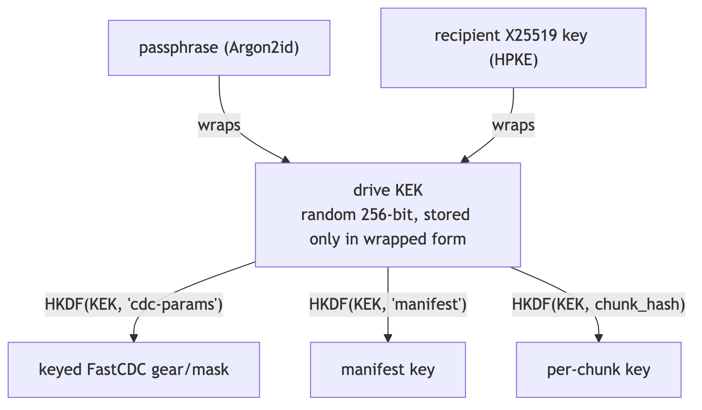

# Web3 Storage client-side encryption and key management

|                 |                                                                                                                                                                                                                                  |
| --------------- | -------------------------------------------------------------------------------------------------------------------------------------------------------------------------------------------------------------------------------- |
| **Start Date**  | 2026-07-21                                                                                                                                                                                                                       |
| **Description** | Replaces Web3 Storage's V1 whole-blob encryption with a per-drive key hierarchy, deterministic per-chunk encryption that keeps content-defined chunking useful on ciphertext, and drive sharing via an on-chain key registry and HPKE. |
| **Authors**     | Ilia Churin                                                                                                                                                                                                                      |
| **Relates to**  | [Scalable Web3 Storage](../web3-storage.md)                                                                                                                                                                                      |

## Summary

Web3 Storage promises that storage providers hold user data without being able to read it. Version 1 of client-side encryption delivers a sound cipher but nothing around it: a single raw symmetric key encrypts each file as one opaque blob, the Rust SDK and the browser UI produce mutually unreadable formats, one of the two browser apps doesn't encrypt at all, and there is no key rotation, no recovery, and no way to share encrypted data with another account. Separately, [PR #209](https://github.com/paritytech/web3-storage/pull/209) introduces content-defined chunking (CDC). While useful for interactive applications such as HackM3, whole-blob encryption with random nonces nullifies CDC: a one-byte edit to an encrypted file changes every byte of the ciphertext, so every version is stored at full size and nothing ever deduplicates.

This design replaces the V1 scheme with three layers that work with CDC instead of against it:

1. **A key hierarchy.** One long-lived master key per drive (the Key Encryption Key, KEK), from which every other key is derived on demand. Nothing but wrapped copies of the KEK is ever stored.
2. **Encrypted CDC.** The client — not the provider — chunks the plaintext, and encrypts each chunk with a key derived from the drive KEK *and the chunk's own content hash*. This makes encryption deterministic per chunk: the same piece of content always produces the same ciphertext within a drive, so the provider's existing content-addressed deduplication keeps working on encrypted data, and small edits re-upload only the changed chunks.
3. **Sharing.** An on-chain registry maps accounts to encryption public keys; granting someone access to a drive means encrypting ("wrapping") the drive KEK to their public key. No data is re-encrypted, no secret travels out of band, and the provider learns nothing.

Success looks like: a file uploaded encrypted using the Rust SDK or directly via an extrinsic opens in the browser and vice versa; editing 1 MB of a 1 GB encrypted file re-uploads roughly 1 MB; a drive can be shared with another account in one step; and the provider learns nothing about plaintext beyond which chunks repeat within a single drive.

What the design deliberately does not do is listed under [Non-goals](#non-goals).

## Motivation

### Background

What currently works in Web3 Storage for client-side encryption:

1. The Rust SDK implements XChaCha20-Poly1305 encryption (format version `0x01`) with a versioned wire format `[version byte][24-byte nonce][ciphertext + tag]`. Fresh random nonces per encryption, key material zeroed on drop, good unit and integration coverage (round-trips, wrong-key, tampering, version checks, nonce uniqueness).
2. Encryption runs before upload and chunking, so the provider only ever sees ciphertext — the core zero-knowledge property holds for data that *is* encrypted.
3. The S3 browser UI implements AES-256-GCM (format version `0x02`) via WebCrypto, with non-extractable keys held in memory only, a key-generation dialog, and encrypt-on-upload / decrypt-on-download wiring.

What remains broken:

1. **Cross-environment interop is broken in both directions.** The Rust decryptor rejects any version byte other than `0x01`; the browser only handles `0x02`. A file encrypted by the CLI is unreadable in the browser and vice versa. (One audit claimed the browser side was entirely unimplemented — that is stale; the implementation exists, it just speaks a different format.)
2. **The Drive browser UI does not encrypt at all.** Its upload path sends plaintext regardless of any key the user holds elsewhere — a silent confidentiality downgrade for users who switch UIs.
3. **All metadata is plaintext.** File names, directory structure, object keys, sizes, and MIME types are stored unencrypted with the provider *and* committed on-chain (metadata Merkle roots, smart-contract calls carrying object keys as plain strings). For many threat models this leaks more than file contents would.
4. **No key management exists.** No password-based derivation, no key wrapping, no rotation, no sharing, no recovery. Losing the key loses the data; this is documented V1 scope, but it is also the wall every planned feature hits.
5. **Encrypted partial reads always fail.** The AEAD tag covers the whole blob, so range reads of encrypted data are impossible by construction (a separate bug also mis-trims ranged reads of chunked plaintext).
6. **The browser decides whether to decrypt by sniffing the first byte** of downloaded data against `0x02`. There is no stored per-object "this is encrypted" flag, so wrong-key and not-encrypted failures are indistinguishable to users.
7. **No browser-side tests** cover encryption.
8. **Two design documents contradict each other.** The [Layer 0 encryption design](https://github.com/paritytech/web3-storage/blob/dev/docs/drafts/CLIENT_SIDE_ENCRYPTION.md) describes whole-blob XChaCha with a raw key (what's built); the [filesystem architecture document](https://github.com/paritytech/web3-storage/blob/dev/docs/filesystems/ARCHITECTURE.md) describes a planned per-file AES-GCM scheme with public-key wrapping and capability-based access control (unbuilt — its only artifact is a permanently empty 512-byte `encryption_params` field on the file manifest). This document supersedes both narratives.

### Goals

1. One blob format decryptable in both Rust and browser environments without the version split.
2. Encrypted data retains CDC benefits: cheap edits, within-drive dedup, and ranged / resumable reads.
3. Key rotation without re-uploading data (rewrap keys, not re-encrypt content).
4. Drive sharing between accounts — first and foremost granting *read* access to non-owners (readers of a drive who must not thereby gain write rights) — with no provider trust and no out-of-band secret exchange.
5. A key-recovery story better than "screenshot this hex string" (not yet covered — see [Unresolved Questions](#unresolved-questions)).
6. The provider needs no knowledge of encryption; the commitment and challenge machinery (MMR checkpoints, Merkle proofs, spot checks) operates on ciphertext chunks unmodified.

### Non-goals

1. **Cross-user dedup of encrypted data.** Deliberately impossible under per-drive keys. The only way to get it is deriving keys from content alone ("convergent encryption" without a user secret), which lets anyone confirm whether you store a known file — see [Alternative B](#b-unkeyed-convergent-encryption).
2. **Forward secrecy.** Meaningful for conversations, meaningless for data at rest: the ciphertext sits with the provider indefinitely, and whoever obtains the recipient's key later can decrypt it regardless of ephemeral-key ceremony at share time.
3. **True revocation.** Anyone who ever held the drive key may have cached plaintext; no cryptography can un-share bytes someone already downloaded. We provide *lazy* revocation only — a revoked user loses access to content written after the next key rotation — and say so honestly in user-facing docs. Any scheme promising more (e.g., proxy re-encryption marketing) should be treated as promising something the threat model cannot deliver.
4. **Proxy re-encryption and group-messaging key agreement (MLS).** Advanced schemes solving problems we don't yet have; see [Alternatives E and F](#e-proxy-re-encryption) for why and when to revisit.
5. **Metadata encryption** (file names, directory structure, object keys). A bigger privacy hole than anything this doc fixes, but architecturally separable and entangled with the on-chain metadata commitments — tracked as a follow-up design (see [Future Directions](#future-directions-and-related-material); whether the split holds is an open question).

## Stakeholders

Affected: users of the Rust and TypeScript SDKs and of the Drive and S3 browser UIs; provider-node operators (a second upload lane and keystore endpoints); the runtime (one new storage map and extrinsic); applications built on the storage, such as HackM3; and PR #209, whose upload seam this design plugs into.

Reviewers: Robert Klotzner, Naren Mudigal, Branislav Kontur, Cisco Aguirre Pérez.

## Explanation

### The core conflict: why encryption defeats CDC today, and what counters it

| CDC benefit | How V1 encryption kills it | What this design does about it |
|---|---|---|
| **Edit locality** — change 1 MB of a 1 GB file, re-upload ~1 MB | The whole file is one AEAD message with a *fresh random nonce* per encryption. Changing one plaintext byte (or nothing at all) re-encrypts the entire blob into completely different bytes, so no two versions share a single chunk. | Chunk the *plaintext* client-side, encrypt *per chunk*, and make chunk encryption **deterministic** — unchanged chunks produce byte-identical ciphertext across versions, so only edited chunks are new. |
| **Dedup** — identical content stored once | Same cause: identical plaintext encrypts to unrelated ciphertext every time, so the provider's hash-based dedup never matches. | Deterministic per-chunk encryption again: within a drive, identical plaintext chunks yield identical ciphertext chunks, and the provider's existing dedup-by-content-hash works on them *without knowing they're encrypted*. |
| **Ranged reads** | One AEAD tag covers the whole blob; a byte range can't be authenticated or decrypted alone. | Per-chunk encryption gives per-chunk tags; the manifest maps byte ranges → chunks, each independently decryptable. |

There is one more, subtler interaction: chunk *boundaries* computed from plaintext are themselves a leak. The sequence of chunk sizes acts as a fingerprint that can identify a known file even when every byte is encrypted. Countered by deriving the FastCDC parameters (the rolling-hash gear table and masks) from the drive key, so boundaries are secret-dependent and not comparable across drives or to public files.

The rest of this section builds the machinery that makes "deterministic per-chunk encryption" safe — because done naively, deterministic encryption is how systems get broken (see [Chunk encryption](#chunk-encryption-wire-format-0x03) and [Alternative C](#c-deterministic-encryption-via-a-fixed-per-user-nonce)).

### Key hierarchy

One random 256-bit *drive KEK* is generated at drive creation and never stored raw. Everything else derives from it via HKDF with distinct, versioned purpose labels ("domain separation" — a different label yields an unrelated key, so compromise or misuse of one derived key says nothing about the others):

The only persisted key material is *wrapped copies of the KEK*: (a) a self-wrap under a key derived from the owner's passphrase via Argon2id, and/or under the owner's own registered public key; (b) one wrap per person the drive is shared with (see [Sharing](#sharing-on-chain-key-registry--hpke)).

Derived keys (chunk keys, manifest key, chunking parameters) are recomputed on demand and never stored — so key storage does not grow with data, and a new device needs only the KEK to reconstruct everything.

Rotation and revocation both operate on this single object (see [Sharing](#sharing-on-chain-key-registry--hpke)).

Why not derive the KEK from the user's blockchain account key? Three reasons, each sufficient alone. (1) *Key separation*: entangling the signing key with data encryption means a chain-key rotation or compromise takes the data hostage with it. (2) *Extractability*: browser wallets and hardware signers expose a `sign()` operation, never the raw private key — a derivation that needs the key bytes cannot run there. (3) The workaround of "sign a fixed message and hash the signature" fails too, because sr25519 signatures are randomized — the same message signs differently every time, so the derived "key" is not reproducible. A dev-mode derivation from a raw seed MAY exist for CLI and testing convenience only.

### Chunk encryption (wire format `0x03`)

Reading this construction as a set of countermeasures:

- **Determinism → dedup and edit locality.** The chunk key depends only on the KEK and the chunk's content hash, and the nonce is a constant. Same plaintext chunk in the same drive → same key, same nonce, same ciphertext, same content address. The provider's dedup (PR #209's mechanism, hashing chunk bytes) therefore dedups encrypted chunks *without modification and without knowing encryption is involved*. Clients stay stateless — no local "have I uploaded this before" index is needed, because determinism makes re-encryption idempotent.
- **Why the constant nonce is safe here — and only here.** The iron rule for stream-cipher AEADs is that a (key, nonce) pair must never encrypt two *different* plaintexts: doing so reuses the keystream, and XOR-ing the two ciphertexts yields the XOR of the plaintexts (a "many-time pad", trivially broken), plus it enables authentication forgeries. In this construction the pair `(chunk_key_i, 0)` repeats **only when the plaintext is byte-identical** — the key *is* a function of the plaintext — and then the "leak" is an identical ciphertext, which is precisely the dedup signal we want and reveals nothing new. This is the keyed convergent encryption construction proven in practice by Tahoe-LAFS; the superficially similar "one fixed nonce, one fixed key for all chunks" variant is catastrophically broken and rejected in [Alternative C](#c-deterministic-encryption-via-a-fixed-per-user-nonce).
- **The accepted leak, stated plainly:** the provider (or anyone holding the ciphertext) learns *which chunks within one drive are equal*, and nothing else. Across drives and users, keys differ, so nothing correlates. [Alternative D](#d-the-resticborgtarsnap-model) documents the stronger-but-heavier alternative if this equality leak ever becomes unacceptable.
- **Context binding (AAD).** Each chunk's tamper-check covers `context = drive_id || format_version`, so a valid ciphertext chunk cannot be replayed into a different drive or format and still decrypt. (Whether the context should also bind bucket and agreement is open — see [Unresolved Questions](#unresolved-questions).)
- **One format, one cipher, both environments.** The non-negotiable part is *one*: a single wire format that Rust and the browser both write and read, interop-tested from shared vectors in CI. Which cipher fills it is a close call: this design says XChaCha20-Poly1305 everywhere (browser via the audited `@noble/ciphers` library, since WebCrypto has no ChaCha family); the defensible alternative is AES-256-GCM everywhere (WebCrypto-native in the browser). [Alternative G](#g-aes-256-gcm-everywhere-instead-of-xchacha20-poly1305-everywhere) compares the two head-to-head and explains the lean.
- **Manifests are encrypted too**, under `HKDF(KEK, "manifest-v1")` with a *random* nonce — manifests are unique per file version, so determinism buys nothing there, and a random nonce is the safer default whenever dedup is not the goal.

### Chunking moves client-side (for encrypted uploads)

- **Encrypted path:** the client runs keyed FastCDC over plaintext, encrypts each chunk as above, and uploads ciphertext chunks plus an encrypted manifest. The provider stores them as opaque content-addressed blobs and MUST NOT re-chunk them — from its perspective they are just blobs whose bytes happen to be high-entropy.
- **Plaintext path:** unchanged — the provider chunks with FastCDC per PR #209.

This split is forced, not chosen: the provider cannot chunk what it cannot read, so any encrypted-CDC design puts the chunker where the plaintext is — the client — which is also how every comparable system works (Tarsnap, restic, borg all chunk client-side; see [Alternative D](#d-the-resticborgtarsnap-model)).

The provider API therefore becomes two-lane. The upload API must express "here is a list of opaque chunks forming one object" without the provider caring why — this seam is the thing to keep clean when reviewing #209, because encrypted CDC plugs into it later. Related housekeeping both lanes share: chunk garbage collection becomes reference-counted (a chunk may serve many manifests), which is new complexity CDC brings regardless of encryption.

The provider's reassembly endpoint (`GET /content?data_root=`, from PR #209) serves encrypted files as-is — the client decrypts per chunk after fetching. Ranged reads work again (see [the core conflict](#the-core-conflict-why-encryption-defeats-cdc-today-and-what-counters-it)). Streaming falls out of the same structure (encrypt/decrypt chunk-by-chunk, never the whole file in memory), addressing a known V1 limitation.

The commitment layer is untouched: MMR checkpoints, Merkle proofs, challenges, and spot checks already operate on whatever chunk bytes the provider holds; ciphertext chunks are committed and challenged exactly like plaintext ones.

### Sharing: on-chain key registry + HPKE

Sharing encrypted data reduces to one question: **how does the drive KEK reach another account, authentically, without the provider or the chain learning it?** The design splits this into discovery (on-chain) and transport (HPKE):

- **Discovery — an on-chain encryption-key registry.** New pallet storage (or an extension of the drive-registry pallet — open, see [Unresolved Questions](#unresolved-questions)) mapping `AccountId → X25519 public key`, set by a signed extrinsic, rotation emitting an event. This dissolves the two classically hard PKI problems — *finding* someone's key and *trusting* it's really theirs — because the chain already binds keys to accounts and account authenticity is the system's existing trust root; it is the one place this project has an unfair advantage over traditional systems. Note these are new, dedicated encryption keys: the system's identities are sr25519 *signing* keys, often locked inside wallets or hardware, and cannot double as encryption keys (same reasoning as in [Key hierarchy](#key-hierarchy)). Consequence: key registration becomes part of account onboarding for encrypted features.
- **Transport — HPKE wraps.** To grant access, the owner unwraps their KEK locally and seals it with HPKE (RFC 9180; X25519 + HKDF-SHA256 + ChaCha20-Poly1305, in `auth` mode) to the grantee's registered public key. `auth` mode means the wrap itself proves *which account granted it* — no separate signature needed. The result is ~100 bytes.
- **Where wraps live.** Wrapped keys must be durable, available to grantees, and ideally not public. Two options: either on-chain in the manifest's existing 512-byte `encryption_params` field (durable and available, but simple only up to ~5 grantees per file/drive, and it publishes the sharing graph on a public chain) or a provider-side keystore committed via the existing MMR machinery (no size cap, sharing graph visible only to the provider, and the commitment means a provider can't silently drop a grant). The design leans provider-side with on-chain commitment; the choice is open — see [Unresolved Questions](#unresolved-questions). Either way the wrap is useless without the grantee's private key.
- **Revoke** = delete the wrap + rotate the KEK for future writes.
- **Rotate** = new KEK epoch; old chunks keep their derived keys (readable by prior grantees — the lazy-revocation caveat from [Non-goals](#non-goals)), new content uses the new epoch, and only the small wraps are rewritten — never the data.
- **Readers vs. writers.** The driving use case is granting *read* access — an audience for a drive — without conferring write rights, and the design separates the two by layer, deliberately. Possession of the KEK grants exactly one thing: the ability to decrypt (and locally re-derive chunk and manifest keys). It grants no ability to modify the drive, because in this system writing is *authorization*, not cryptography: a write only becomes real when the drive-owning account commits the new root on-chain and the provider accepts the upload under the owner's agreement. A malicious reader can craft chunks that encrypt validly under the drive's keys — symmetric AEAD proves key possession, not authorship — but has no way to introduce them into the drive's committed state. Symmetrically, readers must not take a valid AEAD tag as proof the owner wrote the data; content authenticity is anchored in the owner-signed on-chain root that every download is verified against, not in the cipher. Two granularity notes: (1) V1 read grants are per-drive — sharing the KEK shares everything in the drive; per-file or per-folder read grants require inserting an individually wrapped per-file key (a DEK) between the KEK and the chunk keys, an extension the hierarchy accommodates without a format change (whether V1 needs it is open). (2) Multi-*writer* drives need both a KEK wrap and chain-level write delegation on the drive (whether the drive registry supports delegated writers today is open). Both are listed under [Unresolved Questions](#unresolved-questions).

### Sequence: share a drive, grantee reads a file

### API / data model changes (sketch)

| Surface | Change |
|---|---|
| Provider HTTP | Chunk-mode upload (client supplies the chunk list + blobs); wrap keystore endpoints (put/get/list per drive + account). Exact routes open — see [Unresolved Questions](#unresolved-questions). |
| Pallet | `set_encryption_key(x25519_pub)` extrinsic + storage map; `EncryptionKeyRotated` event |
| File manifest (`encryption_params`) | Repurposed: format version, KEK epoch id, owner self-wrap (or pointer into the provider keystore) |
| SDK (Rust + TS) | `Drive::unlock(passphrase \| wallet)`, `share(account)`, `revoke(account)`, `rotate()`; encrypt/decrypt transparent in read/write paths |
| Wire format | New version byte `0x03` (per-chunk); `0x01`/`0x02` remain readable for legacy blobs forever |

## Alternatives Considered

### A. Status quo (whole-blob AEAD, provider-side CDC)

- Pros: shipped, simple.
- Cons: zero CDC benefit for encrypted data, no rotation/sharing possible, interop broken.
- Rejected: it is the problem statement.

### B. Unkeyed convergent encryption

Early Tahoe-LAFS: chunk key = hash of chunk content, no user secret.

- Pros: maximal, global, cross-user dedup.
- Cons: anyone can encrypt a known file and compare ciphertexts — confirming *you* store it (confirmation-of-file attack); worse, for a file that is mostly known except a low-entropy field (a form letter with a salary), an attacker brute-forces the field offline until ciphertexts match (learn-remaining-information attack, Perttula 2008).
- Rejected: unacceptable for private storage. Tahoe itself retrofitted a per-client "convergence secret" — becoming exactly the keyed construction in [Chunk encryption](#chunk-encryption-wire-format-0x03).

### C. Deterministic encryption via a fixed per-user nonce

One drive key, nonce derived from the account key, same for all chunks.

- Pros: superficially achieves determinism with minimal change.
- Cons: **catastrophically broken** — the (key, nonce) reuse that [Chunk encryption](#chunk-encryption-wire-format-0x03) warns about. Every chunk is encrypted with the same keystream, so the XOR of any two ciphertext chunks is the XOR of their plaintexts, recoverable with classical techniques, and Poly1305 authentication collapses to forgeable under pair reuse. The nonce being secret does not help: the attack never needs the nonce, only two ciphertexts.
- Rejected, and documented here so it is not re-proposed. The safe construction varies the *key* per chunk.

### D. The restic/borg/Tarsnap model

**Keyed plaintext-hash chunk IDs + *randomized* encryption** + an encrypted client-side dedup index. Instead of deterministic ciphertext, the client keeps an index mapping chunk ID → already-uploaded ciphertext, checks it before encrypting, and re-references existing ciphertext on a hit.

- Pros: strictly stronger privacy — the provider learns nothing at all, not even within-drive equality, since equality resolution happens inside the client's encrypted index.
- Cons: dedup moves entirely client-side (the provider's content-hash dedup does nothing for encrypted data, since identical plaintext yields fresh ciphertext on every independent encryption); the index becomes critical infrastructure needing durable storage, sync, merge, and rebuild paths — awkward in browsers; and garbage collection against the index is the historically fragile part of restic/borg.
- Rejected *for now*, deliberately kept close: ~90% of the machinery (keyed CDC, per-chunk keys, manifests, KEK hierarchy, wraps) is shared with this design, so this remains the documented upgrade path — a new format version changing key derivation and adding the index — if the equality leak ever matters.

### E. Proxy re-encryption

Umbral/NuCypher-style. The owner publishes a "re-encryption key"; an untrusted proxy (even the storage provider) transforms ciphertext for a grantee without seeing plaintext.

- Pros: philosophically native to decentralized storage; owner can be offline at share time.
- Cons: exotic, thinly audited primitives; threshold variants require an entire node network; and a colluding proxy + grantee is equivalent to a plain grantee anyway.
- Rejected: cost and maturity out of proportion when HPKE wraps (~100 bytes, standard crypto) achieve the product goal for pairwise sharing.

### F. Group key agreement (MLS/TreeKEM)

Group key agreement protocols let a large group continuously maintain a shared secret as membership changes: when someone joins or is removed, the group key updates so the removed member can't compute the new one — and tree-structured schemes (TreeKEM, underlying the IETF's Messaging Layer Security standard, RFC 9420) do this at logarithmic cost instead of re-wrapping for every remaining member individually.

- Pros: the only approach whose *removal* cost stays cheap for groups of hundreds or thousands with churn.
- Cons: designed for ordered message streams between online-ish parties; awkward over static stored data, where old files remain encrypted under old group epochs no matter how elegantly the group rekeys (the lazy-revocation limit applies to MLS too — it just costs far more to hit it); enormous spec surface.
- Rejected: per-drive KEK + rewrap-on-membership-change is linear in group size but trivially simple, and covers foreseeable group sizes; revisit only if "shared drives with hundreds of churning members" becomes a product requirement.

### G. AES-256-GCM everywhere instead of XChaCha20-Poly1305 everywhere

The serious alternative — unlike A–F it is *not* rejected on principle. Both options fix V1's actual defect; they differ in which risk they price higher:

|  | AES-256-GCM everywhere (browser: WebCrypto) | XChaCha20-Poly1305 everywhere (browser: `@noble/ciphers`) |
|---|---|---|
| Browser key handling | Non-extractable `CryptoKey` handles: XSS-injected code can *use* keys while the tab is open but cannot exfiltrate them for later | Key bytes live in JS memory; a single XSS can steal them permanently |
| Supply chain | Zero crypto dependencies — the implementation ships with the browser, vendor-maintained | One audited npm dependency that updates |
| Throughput | Hardware AES (AES-NI / ARM equivalent): multi-GB/s, off the main thread | Pure JS: hundreds of MB/s; a WASM build narrows the gap |
| Timing safety | Native constant-time code | Best-effort constant-time under a JIT |
| Implementation uniformity | Two implementations of one format; the Rust side needs hardware AES for speed and timing safety | One cipher shape everywhere, byte-identical test vectors, synchronous API matching the Rust code 1:1 |
| Per-chunk key derivation | Workable: import the KEK as a non-extractable HKDF base key, `deriveKey` per chunk (async ceremony, per-chunk overhead) | Plain HKDF calls, synchronous |

Two caveats temper WebCrypto's strongest card (non-extractability): WebCrypto has no Argon2id and no HPKE, so raw KEK bytes transit JS memory at unlock and share time regardless — the non-extractable handles protect the derived per-chunk keys and shrink the exfiltration window, but do not seal the vault. The decision is to be re-taken at the browser benchmark checkpoint if throughput or XSS posture proves decisive (see [Unresolved Questions](#unresolved-questions)).

## Drawbacks

- **Equality leak (accepted):** provider sees which chunks repeat within one drive; nothing across drives/users. Small next to today's plaintext-metadata exposure; [Alternative D](#d-the-resticborgtarsnap-model) is the escape hatch.
- **No cross-user dedup (accepted):** the price of resisting confirmation-of-file attacks.
- **Client-side chunking + crypto cost:** see [Performance](#performance).
- **Two permanent upload paths in the provider** — each individually simple, but forever two.

## Testing, Security, and Privacy

- **Two runtimes, one format.** V1's core failure was two teams implementing "the same" design in two ciphers. The countermeasure is structural, not procedural: a single cipher suite, a single test-vector file consumed by both the Rust and TypeScript test suites, and interop tests in CI from the first commit of the key-hierarchy work.
- **Success measures:** interop matrix green in CI (Rust↔browser, encrypt/decrypt both directions, from shared test vectors); re-upload volume after a 1% mid-file edit ≤5% of file size on encrypted drives; zero user-reported decrypt failures attributable to format confusion.
- **Security:** every component is a standard, analyzed construction (HKDF, XChaCha20-Poly1305, HPKE/RFC 9180, Argon2id); the one non-textbook *composition* — keyed convergent encryption with a constant nonce — matches Tahoe-LAFS prior art but **warrants external cryptographic review before general adoption** (whether that review will happen is open — see [Unresolved Questions](#unresolved-questions)). Existing key-hygiene patterns (zeroization, non-extractable handles where applicable) carry over.
- **Privacy:** the provider sees ciphertext, secret-keyed chunk boundaries (not correlatable to known files), and within-drive chunk equality. The chain sees encryption public keys and — only if on-chain wraps are chosen — the sharing graph.
- **Decentralization:** no new trusted parties. The key registry is on-chain; wraps are useless without grantee private keys; any provider can serve any drive's ciphertext; nothing about encryption changes the stake/challenge accountability model.
- **Observability.** Client (SDK) metrics, opt-in: chunking throughput, encrypt/decrypt throughput, dedup hit rate (chunks skipped ÷ total), wrap/unwrap failure counts. Never logged: key material, chunk IDs (content-derived ⇒ sensitive), file names. Provider: chunk-mode upload volume, dedup ratio segmented by format version — expect the aggregate ratio to *drop* as encrypted adoption grows (cross-user dedup is gone by design); segmentation makes that read as adoption, not regression. Chain: registry registrations and rotations via events (existing pallet pattern). Privacy vs. introspection: all content-linked identifiers stay client-side; server metrics are volume and ratio aggregates only.

## Performance, Ergonomics, and Compatibility

### Performance

Uploads add client-side chunking + encryption: native Rust is comfortably >1 GB/s; the browser needs benchmarking, target ≥100 MB/s with a WASM fallback if pure JS falls short (targets to be confirmed — see [Unresolved Questions](#unresolved-questions)). Downloads *improve*: per-chunk decryption restores ranged reads and enables streaming, where V1 required whole-blob download + decrypt.

Scalability: derived keys mean key storage is O(drives × grantees) in wraps and zero in data volume. The provider's dedup index and commitment structures are unchanged.

### Ergonomics

Encryption becomes transparent in the SDK read/write paths behind `Drive::unlock`, `share`, `revoke`, and `rotate`; the Drive UI reaches encryption parity with the S3 UI; a per-object encrypted flag replaces first-byte sniffing, so wrong-key and not-encrypted failures become distinguishable. Key registration becomes part of account onboarding for encrypted features.

### Compatibility

Rollout is additive: provider changes are additive endpoints (no storage migration); the pallet change is one storage map + extrinsic (standard runtime upgrade); legacy formats `0x01`/`0x02` remain readable forever, so there is no flag-day and no forced data migration. Legacy blobs could optionally be re-encrypted to `0x03`, but with no valuable data stored yet this is a non-issue.

## Prior Art and References

- Tahoe-LAFS — keyed convergent encryption via a per-client convergence secret; the construction this design's chunk encryption follows.
- Perttula (2008) — learn-remaining-information attack on unkeyed convergent encryption.
- restic, borg, Tarsnap — client-side chunking with randomized encryption and an encrypted dedup index ([Alternative D](#d-the-resticborgtarsnap-model)).
- [RFC 9180](https://www.rfc-editor.org/rfc/rfc9180) — HPKE, used for KEK wraps in `auth` mode.
- [RFC 9420](https://www.rfc-editor.org/rfc/rfc9420) — Messaging Layer Security (TreeKEM), considered and rejected in [Alternative F](#f-group-key-agreement-mlstreekem).
- Umbral / NuCypher — proxy re-encryption, considered and rejected in [Alternative E](#e-proxy-re-encryption).
- [`@noble/ciphers`](https://github.com/paulmillr/noble-ciphers) — audited XChaCha20-Poly1305 for the browser.
- [web3-storage PR #209](https://github.com/paritytech/web3-storage/pull/209) — content-defined chunking (FastCDC), provider dedup by chunk hash, `GET /content?data_root=`.
- Superseded narratives: the [Layer 0 encryption design](https://github.com/paritytech/web3-storage/blob/dev/docs/drafts/CLIENT_SIDE_ENCRYPTION.md) and the encryption section of the [filesystem architecture document](https://github.com/paritytech/web3-storage/blob/dev/docs/filesystems/ARCHITECTURE.md).

## Unresolved Questions

1. **Key recovery** (Goal 5): a story better than "screenshot this hex string" is not yet covered.
2. **Metadata encryption split** (Non-goal 5): confirm that metadata encryption can be separated into a follow-up design.
3. **AAD contents**: `drive_id || format_version` only, or bucket + agreement too?
4. **Registry placement**: new pallet storage, or an extension of the drive-registry pallet?
5. **Where wraps live**: on-chain in `encryption_params`, or a provider-side keystore committed via the MMR (the lean)?
6. **Per-file / per-folder read grants** (a per-file DEK between the KEK and chunk keys): needed in V1?
7. **Multi-writer drives**: does the drive registry support delegated writers today, or is owner-only write acceptable for V1?
8. **Provider HTTP routes** for chunk-mode upload and the wrap keystore.
9. **Performance targets**: confirm the >1 GB/s native / ≥100 MB/s browser targets and the WASM go/no-go criterion.
10. **Cipher decision**: XChaCha20-Poly1305 everywhere vs AES-256-GCM everywhere — re-decide at the browser benchmark checkpoint if throughput or XSS posture proves decisive.
11. **Sizing**: expected number of drives and grantees per drive, for the registry and keystore.
12. **External cryptographic review** of the keyed-convergent-encryption composition: how likely is it to be done at all, and is it a precondition for GA?
13. **Legal** considerations: not yet assessed.

## Future Directions and Related Material

- **Metadata encryption** (file names, directory nodes, object keys) — a follow-up design; interacts with the S3 metadata index and on-chain commitments.
- **Stronger privacy** — the restic/borg-style encrypted dedup index ([Alternative D](#d-the-resticborgtarsnap-model)) as a new format version, if the within-drive equality leak ever matters.
- **Finer-grained grants** — per-file DEKs and multi-writer drives, both accommodated by the hierarchy without a format change.
- **Group sharing at scale** — MLS/TreeKEM ([Alternative F](#f-group-key-agreement-mlstreekem)), only if shared drives with hundreds of churning members become a requirement.
- Related: [Scalable Web3 Storage](../web3-storage.md), whose commitment and challenge machinery this design leaves untouched.
